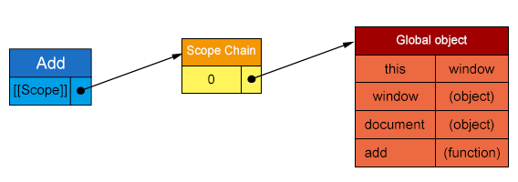

## Data Access [Back](./../high_performance.md)

Similar to other languages, though, where data is stored can greatly affect how quickly it can be accessed later in JavaScript. There are **4 basic places** which data can be accessed:

- **Literal values**
    
    Any value that represents just itself and is not stored in a particular location. **strings**, **numbers**, **Booleans**, **objects**, **arrays**, **functions**, **regular expressions**, and the special values **null** and **undefeind** can be represented as literal.

- **Variables**

    Any developer-defined location for storing data.
    
- **Array items**

    A numerically indexed location within a JavaScript **Array** object.
    
- **Object members**

    A string-indexed location within a JavaScript object.

A general trend has indicated that: **literal values and local variable access tend to be faster than array item and object member access**. So the advice is to use literal values and local variables whenever possible, and limit use of array items and object members, which speed of execution is a concern.

### Managing Scope

When dealing with scope, we must consider performance as well. That's why we should understand exactly how scope works before, and how speed relates to scope.

#### Scope Chains and Identifier Resolution

In JavaScript, any function is represented as an object, which will have accessible properties or not accessible like [[Scope]]. The internal [[Scope]] property contains a collection of objects, representing **the scope in which the function was created**. This collection is named the function's **Scope Chain**, which will determine the data that a function can access. Objects in the Scope chain are called **Variable Objects**, each of which will contains entries for variables in the form of key-value pairs.

```js
function add(num1, num2) {
    var sum = num1 + num2;
    return sum;
}
```

Like the function `add()`, its Scope Chain will contain an object, which is pointed to the Global object, which means that this function is created at the global scope:



Suppose that the following code is executed:

```js
var total = add(5, 10);
```

Executing the `add()` function will trigger the creation of an internal object called **Execution Context**, which defines the environment in which a function is being executed. After a function has been completely executed, the execution context will be destroyed.

An execution object will have its own scope chain, which will stores two objects: **Activation object** and **Global object**. The activation object will contain entries for all local variables, named arguments, the **arguments** collection, and **this**.


What we can see above is that the activation object has been pushed to the front of the scope chain, and it will be destroyed as the execution context is destroyed.

Variable identifying will search the scope chain, and is deemed to be undefined when none is matched.
