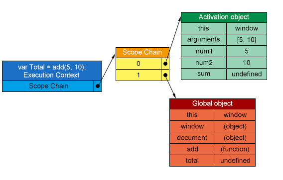
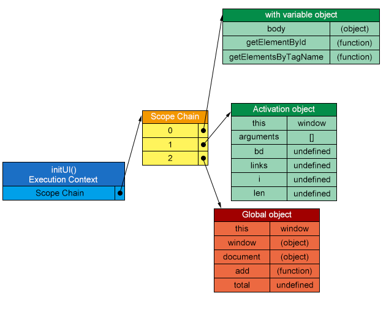
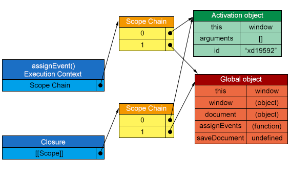
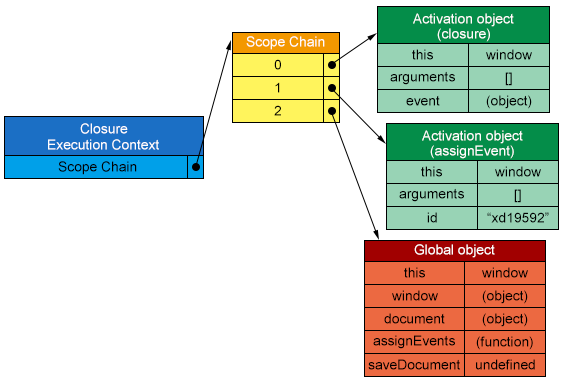
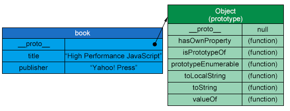
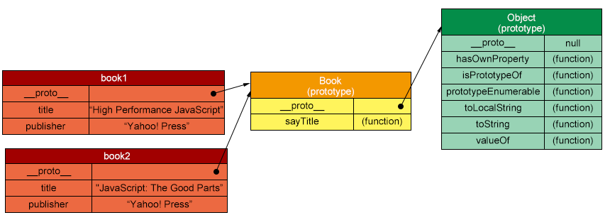

## Data Access [Back](./../high_performance.md)

Similar to other languages, though, where data is stored can greatly affect how quickly it can be accessed later in JavaScript. There are **4 basic places** which data can be accessed:

- **Literal values**

    Any value that represents just itself and is not stored in a particular location. **strings**, **numbers**, **Booleans**, **objects**, **arrays**, **functions**, **regular expressions**, and the special values **null** and **undefined** can be represented as literal.

- **Variables**

    Any developer-defined location for storing data.

- **Array items**

    A numerically indexed location within a JavaScript **Array** object.

- **Object members**

    A string-indexed location within a JavaScript object.

A general trend has indicated that: **literal values and local variable access tend to be faster than array item and object member access**. So the advice is to use literal values and local variables whenever possible, and limit use of array items and object members, which speed of execution is a concern.

### Managing Scope

When dealing with scope, we must consider performance as well. That's why we should understand exactly how scope works before, and how speed relates to scope.

#### Scope Chains and Identifier Resolution

In JavaScript, any function is represented as an object, which will have accessible properties or not accessible like [[Scope]]. The internal [[Scope]] property contains a collection of objects, representing **the scope in which the function was created**. This collection is named the function's **Scope Chain**, which will determine the data that a function can access. Objects in the Scope chain are called **Variable Objects**, each of which will contains entries for variables in the form of key-value pairs.

```js
function add(num1, num2) {
    var sum = num1 + num2;
    return sum;
}
```

Like the function `add()`, its Scope Chain will contain an object, which is pointed to the Global object, which means that this function is created at the global scope:


Suppose that the following code is executed:

```js
var total = add(5, 10);
```

Executing the `add()` function will trigger the creation of an internal object called **Execution Context**, which defines the environment in which a function is being executed. After a function has been completely executed, the execution context will be destroyed.

An execution object will have its own scope chain, which will stores two objects: **Activation object** and **Global object**. The activation object will contain entries for all local variables, named arguments, the **arguments** collection, and **this**.



What we can see above is that the activation object has been pushed to the front of the scope chain, and it will be destroyed as the execution context is destroyed.

Variable identifying will search the scope chain, and is deemed to be undefined when none is matched. It's this search process that affects performance.

> **Two variables with the same name may exist in different parts of the scope chain**. In that case, the identifier is bound to the variable that is found first in the scope chain traversal, and the first variable is said to shadow the second.

#### Identifier Resolution Performance

Consequently, **local variables are always the fastest to access inside of a function, whereas global variables will generally be the slowest**. As the depth grows, the time of this process will grow as well.

So, it's advisable to use local variables whenever possible to improve performance in browsers without optimizing JavaScript engines. Consider the following example:

```js
function initUI() {
    var bd = document.body;
    var links = document.getElementsByTagName('a');
    var i = 0;
    var len = links.length;

    while (i < len) {
        update(links[i++]);
    }

    document.getElementById('go-btn').onclick = function () {
        start();
    };

    bd.className = 'active';
}
```

This function contains three referencs to `document`, which is a global object. In order to reduce the cost of accessing it, we are recommended to code like that:

```js
function initUI() {
    /** store a reference to `document` in the local `doc` variable */
    var doc = document;
    var bd = doc.body;
    var links = doc.getElementsByTagName('a');
    var i = 0;
    var len = links.length;

    while (i < len) {
        update(links[i++]);
    }

    doc.getElementById('go-btn').onclick = function () {
        start();
    };

    bd.className = 'active';
}
```

#### Scope Chain Augmentation(擴大化)

Though we won't change an execution context's scope chain, we can also temporarily augment the scope chain while it's being executed with two statements. The first of these is `with`, which is usually seen as a convenience to avoid writing the same code repeatedly.

```js
function initUI() {
    with (document) {
        /** avoid! */
        var bd = doc.body;
        var links = doc.getElementsByTagName('a');
        var i = 0;
        var len = links.length;

        while (i < len) {
            update(links[i++]);
        }

        doc.getElementById('go-btn').onclick = function () {
            start();
        };

        bd.className = 'active';   
    }
}
```

Though this may seem more efficient, it actually creates a performance problem. While executing the `with` statement, the execution context's scope chain is temporarily augmented. A new variable object is created containing all of the properties of the specified object, like `document` here, which will be pushed to the front of the scope chain. That means local variables are now in the second scope chain object, make it more expensive to access.



Besides `with` statement, the `try-catch` statement also has the same effect:

```js
try {
    throwError();
} catch (e) {
    /** scope chain is augmented here */
    console.log(e.message);
}
```

However, since `try-catch` statement is still useful for us, we are recommended to use it when we have met some error we do not know. To minimize the performance impact by executing as little code as necessary within it, we can **use a method to handle this error**. Since there is just one statement executed and no local variables accessed, the temporary scope chain augmentation does not affect the performance of the code.

```js
try {
    throwError();
} catch (e) {
    /** delegate to a handler method */
    handleError(e);
}
```

#### Dynamic Scopes

Both the `with` statement and the `catch` clause of a `try-catch` statement, as well as a function containing `eval()`, are all considered to be **Dynamic Scopes**. A dynamic scope is one that exists only through execution of code and therefore cannot be determined simply by static analysis.

```js
function exeucte(code) {
    eval(code);

    function subroutine() {
        return window;
    }

    /** what value is w? */
    var w = subroutine();
}
```

You will probably say that `w` should be the `window` object. However, it may not when I call like this, and `w` will be equal to the local object rather than the global one:

```js
execute('var window = {};');
```

Some optimizing JavaScript engines such as Safari's Nitro try to avoid the traditional scope chain lookup by indexing identifiers for faster resolution. **When a dynamic scope is involved, however, this optimization is no longer valid**. In reverse, the engines should take more cost to switch back to a slower approach. For this reason, its recommended to use dynamic scopes only when absolutely necessary.

#### Closures, Scope, and Memory

There may be a performance impact associated with using closures.

```js
function assignEvents() {
    var id = 'xd19592';

    document.getElementById('save-btn').onclick = function (event) {
        saveDocument(id);
    };
}
```

When `assignEvents()` is executed, an activation object is created that contains, among other things, the `id` variable. When the closure is created, its [[Scope]] will be also initialized with this object. That's where a side effect is.



When there is a closure involved, though, the activation object can not be destroyed after the function has been executed, because a reference still exists, which results in more memory overhead. When it comes to a large web application, it will be a disaster for that application. Especially where **Internet Explorer** is concerned. IE implements DOM objects as non-native JavaScript objects, in which closures will cause memory leaks.

Using closures will bring out another performance problem. When the closure defined above is executed, an execution context is created whose scope chain is initialized with the same two scope chain objects referenced in [[Scope]], in which **the activation object of this closure will become the first one in the scope chain**. It means that each time you access `id` and `saveDocument`, you have to access a lot of out-of-scope identifiers.



To mitigate the execution speed impact, remember a principle: **store any frequently used out-of-scope variables in local variables, and then access the local variables directly**.

### Object Members

In JavaScript, functions are represented as objects, with methods, which is named members referencing a function, or properties, which is named members referencing a non-function data type.

#### Prototypes

Objects in JavaScript are based on `prototypes`. A prototype is an object that serves as the base of another object, defining and implementing members that a new object must have.

An object is tied to its prototype by an internal property. Firefox, Safari, and Chrome expose this property to developers as `__proto__`; other browsers do not allow script access to this property.

An object can have two types of members: **instance members (also called "own" members)**, and **prototype members**. Consider the following object `book`:

```js
var book = {
    title: 'High Performance JavaScript',
    publisher: 'Yahoo! Press'
};

console.log(book.toString());   /** => [object Object] */
```

The `book` object has two instance members: `title` and `publisher`, while `toString()` is a prototype member that `book` inherited from `Object`.



`hasOwnProperty` is a method to check whether an object has an instance member by given name. If you want to check whether an object has access to a property with a given name, you can use `in` operator.

```js
console.log(book.hasOwnProperty('title'));      /** => true     */
console.log(book.hasOwnProperty('toString'));   /** => false    */

console.log('title' in book);                   /** => true     */
console.log('toString', in book);               /** => true     */
```

#### Prototype Chains

By default, all objects are instances of Object and inherit all the basic method. In order to create a prototype of another type, we can define and use a constructor:

```js
function Book(title, publisher) {
    this.title = title;
    this.publisher = publisher;
}

Book.prototype.sayTitle = function () {
    console.log(this.title);
};

var book1 = new Book('High Performance JavaScript', 'Yahoo! Press');
var book2 = new Book('JavaScript: The Good Parts', 'Yahoo! Press');

console.log(book1 instanceof Book);     /** => true                          */
console.log(book1 instanceof Object);   /** => true                          */
book1.sayTitle();                       /** => "High Performance JavaScript" */
console.log(book1.toString());          /** => "[object Object]"             */
```

As we see above, `book1` and `book2` are both instances of `Book`, so the `__proto__` of them will point to the prototype of `Book`, and the `__proto__` of `Book.prototype` will point to the prototype of `Object`. This is a chain named **Prototype Chains**. The following picture has figured out the detailed information:



Searching members will go through this chain. For example, when `book1.toString()` is called, the search must go deeper into the prototype to resolve the object member `toString`. Therefore, deeper the search go into, more overhead will be taken to complete this search. Just keep in mind that the process of looking up an instance member is still more expensive than accessing data from a literal or a local variable.

#### Nested Members

Nested members are normally seen in JavaScirpt, which we will use `.` notation
to access like `window.location.href`. Each time a dot is encountered, the JavaScript engine will go through the object member resolution process. Obviously, the deeper the nested member, the slower the data is accessed. It means that, `location.href` is always faster than `window.loation.href`, which is faster than `window.location.href.toString()`.

In some cases, we will use `[]` to access members of an object. Here is a point we should know:

> In most browsers, there is no discernible(明顯的) difference between using `[]` notation and `.` notation.  However, in Safari, `.` notation is consistently faster than using `[]`.

#### Caching Object Member Values

Since performance issues related to object members has existed, it's advised to avoid using this only when necessary. For instance, there's no reason to read the value of an object member more than once in a single function:

```js
function hasEitherClass(ele, className1, className2) {
    return ele.className === className1 || ele.className === className2;
}
```

Instead, we should use a local variable, which can be accessed faster, to store this value:

```js
function hasEitherClass(ele, className1, className2) {
    var className = ele.className;
    return className === className1 || className === className2;
}
```

> It's not recommended to use `this` technique for object method. Because when changing the value of `this` will lead to programmatic errors.

### Summary

There are four places to access data from: literal values, variables, array items, and object members. These locations all have different performance considerations.

- Literal values and local variables can be accessed very quickly, whereas array items and object members take longer.
- Accessing local variables is faster than out-of-scope variables, because they exist in the first variable object of the scope chain, while global variables are the slowest to access.
- Avoid using `with`, `try-catch` or `eval()`.
- Try to minimize nested object members.
- The deeper into the prototype chain that a property or method exists, the slower it is to access.
