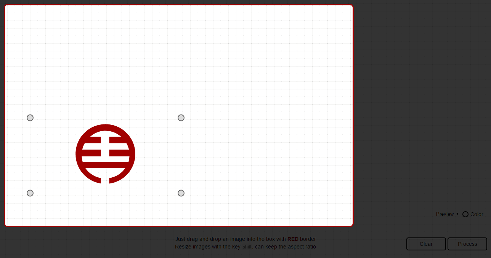
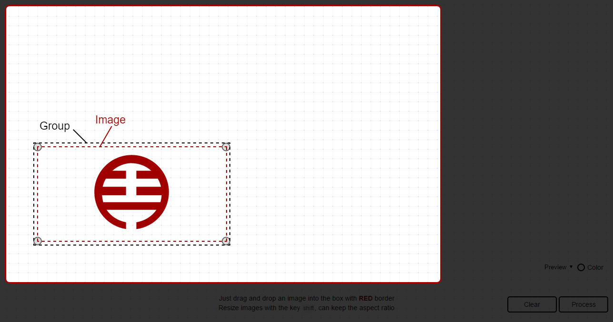

## Calibration parameters for drawing a SVG file [Back](./../SVG.md)

Here what I wrote is all about recording the calculation of the calibration parameters when drawing a SVG file. Before that, you're supposed to know [how to draw](./../../canvas/drawing_a_svg/drawing_a_svg.md) a SVG file with canvas in JavaScript.

### Why need calibration parameters?

In the last step of drawing, we will find that there exists a problem. As shown below, there is a canvas area, which I call **a panel**.


When I drop a SVG file into this panel, and start to draw it,


I find that only data of points is not enough, because the data should always depend on some attributes of a SVG element, including `width`, `height`, and `viewBox`. Besides, what if I can drag and resize this SVG like below:




As I change the size of this SVG, data of points in paths won't change at the same time. What that means is that what I have drawn should be always in the same position.

Attributes like `width`, `height`, and `viewBox` of this SVG element will also affect data of points like dragging.

```html
<svg xmlns="http://www.w3.org/2000/svg" width="400" height="200" viewBox="0 0 200 200">
    <!-- paths -->
</svg>
```

That's why I need a calibration parameter for updating data of points in paths.

### Calculation

So I have defined some parameters: `dx`, `dy`, `ratioX`, and `ratioY`. Before calculation, there are some aspects needed to be explained.

- **Group**: a group for storing image and 4 respective circles, which is used for dragging to resize
- **Image**: the image stored in a group




#### Positions

`(dx,dy)` represent the current position of that image.


- **oriX**: the original `x` value of the image
- **oriY**: the original `y` value of the image
- **moveX**: difference of the `x` value.
- **moveY**: difference of the `y` value.
- **viewBoxX**: the `x` value of the attribute `viewBox` of that image
- **viewBoxY**: the `y` value of the attribute `viewBox` of that image

```js
var dx = image.oriX + image.moveX - image.viewBoxX;
var dy = image.oriY + image.moveY - image.viewBoxY;
```

***Note: remember that the `x` and `y` value of the attribute `viewBox` will also crop that SVG to show.***


For this reason, we should fill data of points before drawing like this:

```js
var pointsArr = [];
var pathLen = pathNodes.length;

for (var j = 0; j < pathLen; j++) {
    var index = pointsArr[].push([]);
    var pointsLen = pathNodes[j].getTotalLength();
    
    for (var k = 0; k < pointsLen; k++) {
        /** extract points from a path */
        var data = pathNodes[j].getPointAtLength(k);
        
        if (data.x >= dx &&
            data.x <= dx + image.curW &&
            data.y >= dy &&
            data.y <= dy + image.curH) {
            pointsArr[index].push();
        }
        
    }
}
```

#### Ratio

Ratio is affected by some factors, and the `calibrationParam` is calculated as below:

- **oriW**: the original width of the image
- **oriH**: the original height of the image
- **svgW**: the width of the SVG element
- **svgH**: the height of the SVG element
- **viewBoxW**: the width of the attribute `viewBox` in that SVG element
- **viewBoxH**: the height of the attribute `viewBox` in that SVG element
- **curW**: the current width of the image
- **curH**: the current height of the image

```js
var calibrationParam = Math.max(image.oriW / image.svgW, image.oriH / image.svgH) * Math.min(image.svgW / image.viewBoxW, image.svgH / image.viewBoxH);

var ratioX = (image.curW / image.oriW) * calibrationParam;
var ratioY = (image.curH / image.oriH) * calibrationParam;
```
