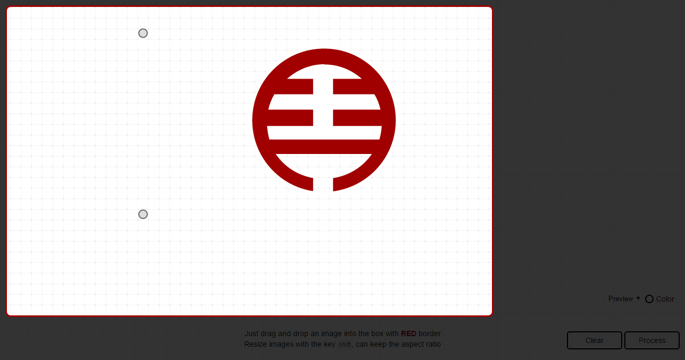

## Calibration parameters for drawing a SVG file [Back](./../SVG.md)

Here what I wrote is all about recording the calculation of the calibration parameters when drawing a SVG file. Before that, you're supposed to know [how to draw](./../../canvas/drawing_a_svg/drawing_a_svg.md) a SVG file with canvas in JavaScript.

### Why need calibration parameters?

In the last step of drawing, we will find that there exists a problem. As shown below, there is a canvas area, which I call **a panel**.


When I drop a SVG file into this panel, and start to draw it,


I find that only data of points is not enough, because the data should always depend on some attributes of a SVG element, including `width`, `height`, and `viewBox`. Besides, what if I can drag and resize this SVG like below:




As I change the size of this SVG, data of points in paths won't change at the same time. What that means is that what I have drawn should be always in the same position.

Attributes like `width`, `height`, and `viewBox` of this SVG element will also affect data of points like dragging.

```html
<svg xmlns="http://www.w3.org/2000/svg" width="400" height="200" viewBox="0 0 200 200">
<path id="path3" style="fill:#a10000;" d="M209.5,160.134c18-2.905,33.225-12.634,42.771-26.634H208h-13
	h-48.63c9.419,14,24.13,23.463,41.13,26.515v14.44c-38-5.712-67.083-38.587-67.083-78.288c0-43.723,35.569-79.167,79.292-79.167
	s78.979,35.444,78.979,79.167c0,40.278-30.188,73.53-69.188,78.52V160.134z"/>
<path id="path1" style="fill:#ffffff;stroke-miterlimit:10;" d="M200.198,34.273c-15.919,0-30.338,6.227-41.5,16.227H187.5v17H180
	h-35.196c-3.067,5-5.355,11-6.711,17H187.5v18h-50.736c0.279,4,1.152,10,2.551,15H200h60.646c1.399-5,2.272-10,2.551-15H209.5v-18
	h52.368c-1.356-6-3.643-12-6.711-17h-35.196H209.5v-17h31.764c-11.163-10-25.562-15.977-41.481-15.977z"/>
</svg>
```