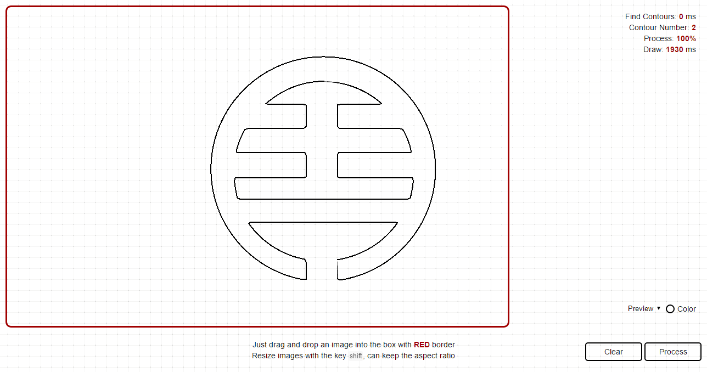

## Drawing a SVG file [Back](./../canvas.md)

This document is to talk about how to draw a SVG file with canvas in JavaScript.



### Preview

Just drag a svg file onto the box shown below with a dark read border:

<br />

<iframe height='612' scrolling='no' src='//codepen.io/aleen42/embed/rrKdpV/?height=612&theme-id=21735&default-tab=result&embed-version=2' frameborder='no' allowtransparency='true' allowfullscreen='true' style='width: 100%;'>See the Pen <a href='http://codepen.io/aleen42/pen/rrKdpV/'>rrKdpV</a> by aleen42 (<a href='http://codepen.io/aleen42'>@aleen42</a>) on <a href='http://codepen.io'>CodePen</a>.
</iframe>

<br />

### Read data from a SVG file

Before drawing a SVG file, you need to read data from a SVG file with `FileReader` in JavaScript. 
 
```js 
var fileReader = new FileReader(); 
``` 
 
`FileReader` is a Web API, which has given some methods for you to read a file.`readAsText` is one of methods, supported by this Web API, for reading file with its contents, and `onload` is the event triggered when a file has been read: 
 
```js 
fileReader.onload = function (e) {
    /** contents of a SVG file */
    var contents = e.target.result;
}; 
 
fileReader.read(file); 
``` 
 
Of course, if you would like to complete a interaction of dragging and dropping a file into a canvas to read a SVG file, you can set up a event handler for listening to the `drop` event of this canvas like this: 
 
```js 
/** Drop Event Handler */ 
canvas.addEventListener('drop', function (e) { 
    /** e is where we can extract out the `file` objecj */ 
    var file = e.dataTransfer.files[0]; 
}) 
```

### Find out what we can draw

In a SVG file, many kinds of tags has been defined for rendering vector shapes like `circle`, `rect`, `polyline`, `line`, `path`, etc. `path` elements are actually what we are going to draw, because any shape/primitive in a SVG is able to be converted into `path`. [Later posts](./../../SVG/convert_shapes_to_path/convert_shapes_to_path.md) will mention how to do this in JavaScript.

Since we are going to draw `path`s, data of these `path`s in a SVG file should be extracted firstly:

```js
var paths = contents.match(/<path([\s\S]+?)\/>/g);
```

Generally, the attribute `d` is represented as data of a `path`. To make it useful, I have converted this data into a legal DOM, `SVGPathElement`.

```js
if (paths) {
    var pathNodes = [];
    var pathLen = paths.length;
    
    for (var i = 0; i < pathLen; i++) {
        /** create a legal DOM node, SVGPathElement */
        var pathNode = document.createElementNS('http://www.w3.org/2000/svg', 'path');
        
        /** use a temporary div elements for reading the attribute `d` */
        var tmpDiv = document.createElement('div');
        tmpDiv.innerHTML = path[i];
        
        /** set it into the legal one */
        pathNode.setAttribute('d', tmpDiv.childNodes[0]
            .getAttribute('d')
            .trim()
            .split('\n').join('')
            .split('	').join('')
        );
        
        /** store it into an array */
        pathNodes.push(pathNode);
    }
}
```

### Extract points to draw

If we have a legal SVG `path` element, we can call `getPointAtLength()` to extract points to draw:

```js
var pointsArr = [];
var pathLen = pathNodes.length;

for (var j = 0; j < pathLen; j++) {
    var index = pointsArr[].push([]);
    var pointsLen = pathNodes[j].getTotalLength();
    
    for (var k = 0; k < pointsLen; k++) {
        /** extract points from a path */
        pointsArr[index].push(pathNodes[j].getPointAtLength(k));
    }
}
```

With positions data of points, you an draw them with canvas like this:

```js
/** draw the path with given index */
function drawPath(index) {
    var ctx = canvas.getContext('2d');
    ctx.beginPath();
    
    /** set path */
    ctx.moveTo(pointsArr[index][0].x, pointsArr[index][0].y);
    
    for (var i = 1; i < pointsArr[index].length; i++) {
        ctx.lineTo(pointsArr[index][i].x, pointsArr[index][i].y);
    }
    
    /** render */
    ctx.stroke();
}
```

### Calibration parameters

Something wrong has been talked about in a [later post](./../../SVG/calibration_parameters/calibration_parameters.md).