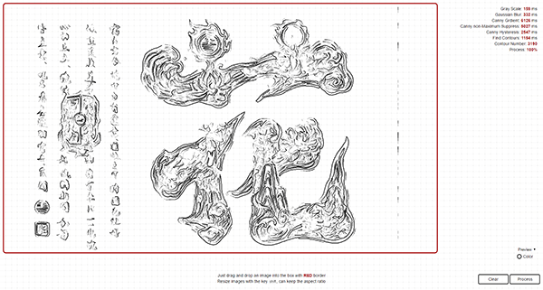
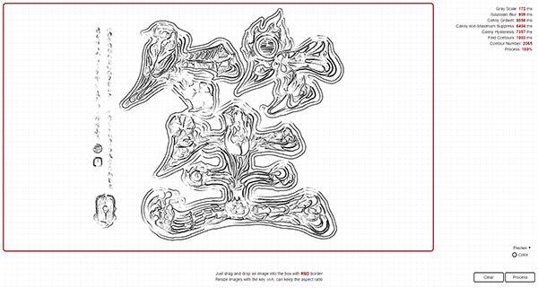
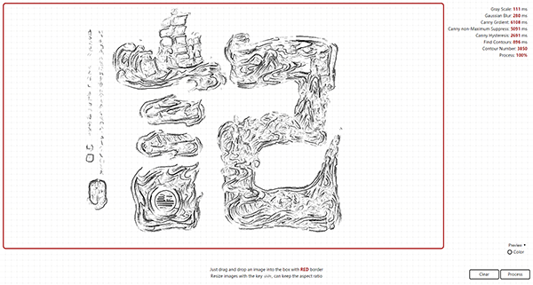

## Finding Contours of a bitmap image [Back](./../canvas.md)

Here I want to talk about how to find contours of a bitmap image in Canvas, and documenting it so that we can check it later when it's required.

 

 

 

Firstly, the whole process of finding can be simply described as: **Gray Scale** -> **Gaussian Blur** -> **Canny Gradient** -> **Canny Non-maximum Suppression** -> **Canny Hysteresis** -> **Scanning**. As we all know, that's [Canny Edge Detection](https://en.wikipedia.org/wiki/Canny_edge_detector).

Before introducing all that process, we are going to set up some common functions first:

```js
function runImg(canvas, size, fn) {
    for (var y = 0; y < canvas.height; y++) {
        for (var x = 0; x < canvas.width; x++) {
            var i = x * 4 + y * canvas.width * 4;
            var matrix = getMatrix(x, y, size);
            fn(i, matrix);
        }
    }

    function getMatrix(cx, cy, size) {
        /**
         * will generate a 2d array of size x size given center x,
         * center y, size, image width & height
         */
        if (!size) {
            return;
        }
        
        var matrix = [];
        
        for (var i = 0, y = -(size - 1) / 2; i < size; i++, y++) {
            matrix[i] = [];
            
            for (var j = 0, x = -(size - 1) / 2; j < size; j++, x++) {
                matrix[i][j] = (cx + x) * 4 + (cy + y) * canvas.width * 4;
            }
        }
        
        return matrix;
    }
}

function getRGBA(start, imgData) {
    return {
        r: imgData.data[start],
        g: imgData.data[start + 1],
        b: imgData.data[start + 2],
        a: imgData.data[start + 3]
    };
}

function getPixel(i, imgData) {
    if (i < 0 || i > imgData.data.length - 4) {
        return {
            r: 255,
            g: 255,
            b: 255,
            a: 255
        };
    } else {
        return getRGBA(i, imgData);
    }
}

function setPixel(i, val, imgData) {
    imgData.data[i] = typeof val === 'number' ? val : val.r;
    imgData.data[i + 1] = typeof val === 'number' ? val : val.g;
    imgData.data[i + 2] = typeof val === 'number' ? val : val.b;
}
```

### Gray Scale

Gray Scale in Wikipedia is defined as followed:

> In photography and computing, a **grayscale** or **greyscale** digital image is an image in which the value of each pixel is a single sample, that is, it carries only intensity information."

In this process, we will change the image data directly through Canvas:

<br />

<iframe height='1315' scrolling='no' src='//codepen.io/aleen42/embed/bwWNRp/?height=1315&theme-id=21735&default-tab=result&embed-version=2' frameborder='no' allowtransparency='true' allowfullscreen='true' style='width: 100%;'>See the Pen <a href='http://codepen.io/aleen42/pen/bwWNRp/'>bwWNRp</a> by aleen42 (<a href='http://codepen.io/aleen42'>@aleen42</a>) on <a href='http://codepen.io'>CodePen</a>.
</iframe>

<br />

```js
function calculateGray(pixel) {
    return ((0.3 * pixel.r) + (0.59 * pixel.g) + (0.11 * pixel.b));
}

function grayscale(canvas) {
    var ctx = canvas.getContext('2d');

    var imgDataCopy = ctx.getImageData(0, 0, canvas.width, canvas.height);
    var grayLevel;
    
    runImg(canvas, null, function (current) {
        grayLevel = calculateGray(getPixel(current, imgDataCopy));
        setPixel(current, grayLevel, imgDataCopy);
    });
    
    ctx.putImageData(imgDataCopy, 0, 0);
}
```

### Gaussian Blur

Gaussian Blur is used to increase the accuracy of contours finding, which is also know as the first step of a canny edge detector.

<br />

<iframe height='1292' scrolling='no' src='//codepen.io/aleen42/embed/ozWjEo/?height=1292&theme-id=21735&default-tab=result&embed-version=2' frameborder='no' allowtransparency='true' allowfullscreen='true' style='width: 100%;'>See the Pen <a href='http://codepen.io/aleen42/pen/ozWjEo/'>ozWjEo</a> by aleen42 (<a href='http://codepen.io/aleen42'>@aleen42</a>) on <a href='http://codepen.io'>CodePen</a>.
</iframe>

<br />

```js
function sumArr(arr) {
    var result = 0;
    
    arr.map(function(element, index) {
        result += (/^\s*function Array/.test(String(element.constructor))) ? sumArr(element) : element;
    });
    
    return result;
}

function generateKernel(sigma, size) {
    var kernel = [];
    
    /** Euler's number rounded of to 3 places */
    var E = 2.718;
    
    for (var y = -(size - 1) / 2, i = 0; i < size; y++, i++) {
        kernel[i] = [];
        
        for (var x = -(size - 1) / 2, j = 0; j < size; x++, j++) {
            /** create kernel round to 3 decimal places */
            kernel[i][j] = 1 / (2 * Math.PI * Math.pow(sigma, 2)) * Math.pow(E, -(Math.pow(Math.abs(x), 2) + Math.pow(Math.abs(y), 2)) / (2 * Math.pow(sigma, 2)));
        }
    }
    
    /** normalize the kernel to make its sum 1 */
    var normalize = 1 / sumArr(kernel);
    
    for (var k = 0; k < kernel.length; k++) {
        for (var l = 0; l < kernel[k].length; l++) {
            kernel[k][l] = Math.round(normalize * kernel[k][l] * 1000) / 1000;
        }
    }
    
    return kernel;
}

function gaussianBlur(canvas, sigma, size) {
    var ctx = canvas.getContext('2d');
    
    var imgDataCopy = ctx.getImageData(0, 0, canvas.width, canvas.height);
    var kernel = generateKernel(sigma, size);
    
    runImg(canvas, size, function (current, neighbors) {
        var resultR = 0;
        var resultG = 0;
        var resultB = 0;
        var pixel;
            
        for (var i = 0; i < size; i++) {
            for (var j = 0; j < size; j++) {
                pixel = getPixel(neighbors[i][j], imgDataCopy);
                
                /** return the existing pixel value multiplied by the kernel */
                resultR += pixel.r * kernel[i][j];
                resultG += pixel.g * kernel[i][j];
                resultB += pixel.b * kernel[i][j];
            }
        }
        
        setPixel(current, {
            r: resultR,
            g: resultG,
            b: resultB
        }, imgDataCopy);
    });
    
    ctx.putImageData(imgDataCopy, 0, 0);
}
```

### Canny Gradient

In this step, we are going to find the intensity gradient (*G*) of the image. Before that, we have to used the value for the first derivative in the horizontal direction (*G<sub>x</sub>*) and the vertical direction (*G<sub>y</sub>*), returned by a edge detector (Roberts, Prewitt, Sobel, etc.). [Sobel](https://en.wikipedia.org/wiki/Sobel_operator) Detector is exactly what we used.

<br />

<iframe height='1322' scrolling='no' src='//codepen.io/aleen42/embed/WGjRXB/?height=1322&theme-id=21735&default-tab=result&embed-version=2' frameborder='no' allowtransparency='true' allowfullscreen='true' style='width: 100%;'>See the Pen <a href='http://codepen.io/aleen42/pen/WGjRXB/'>WGjRXB</a> by aleen42 (<a href='http://codepen.io/aleen42'>@aleen42</a>) on <a href='http://codepen.io'>CodePen</a>.
</iframe>

<br />

Before using gradient, we are going to export a module, which is used for pixel operations, named `Pixel`.

```js
(function(exports) {
    var DIRECTIONS = [
        'n',
        'e',
        's',
        'w',
        'ne',
        'nw',
        'se',
        'sw'    
    ];

    function Pixel(i, w, h, canvas) {
        this.index = i;
        this.width = w;
        this.height = h;
        this.neighbors = [];
        this.canvas = canvas;

        DIRECTIONS.map(function(d, idx) {
            this.neighbors.push(this[d]());
        }.bind(this));
    }

    /**
     * This object was created to simplify getting the
     * coordinates of any of the 8 neighboring pixels
     * _______________
     * | NW | N | NE |
     * |____|___|____|
     * | W  | C | E  |
     * |____|___|____|
     * | SW | S | SE |
     * |____|___|____|
     * given the index, width and height of matrix
    **/

    Pixel.prototype.n = function() {
        /**
         * pixels are simply arrays in canvas image data
         * where 1 pixel occupies 4 consecutive elements
         * equal to r-g-b-a
         */
        return (this.index - this.width * 4);
    };

    Pixel.prototype.e = function() {
        return (this.index + 4);
    };

    Pixel.prototype.s = function() {
        return (this.index + this.width * 4);
    };

    Pixel.prototype.w = function() {
        return (this.index - 4);
    };

    Pixel.prototype.ne = function() {
        return (this.index - this.width * 4 + 4);
    };

    Pixel.prototype.nw = function() {
        return (this.index - this.width * 4 - 4);
    };

    Pixel.prototype.se = function() {
        return (this.index + this.width * 4 + 4);
    };

    Pixel.prototype.sw = function() {
        return (this.index + this.width * 4 - 4);
    };

    Pixel.prototype.r = function() {
        return this.canvas[this.index];
    };

    Pixel.prototype.g = function() {
        return this.canvas[this.index + 1];
    };;

    Pixel.prototype.b = function() {
        return this.canvas[this.index + 2];
    };

    Pixel.prototype.a = function() {
        return this.canvas[this.index + 3];
    };

    Pixel.prototype.isBorder = function() {
        return (this.index - (this.width * 4)) < 0 ||
            (this.index % (this.width * 4)) === 0 ||
            (this.index % (this.width * 4)) === ((this.width * 4) - 4) ||
            (this.index + (this.width * 4)) > (this.width * this.height * 4);
    };

    exports.Pixel = Pixel;
}(this));
```

Then here we are going to complete the gradient part:

```js
function roundDir(deg) {
    /** rounds degrees to 4 possible orientations: horizontal, vertical, and 2 diagonals */
    var deg = deg < 0 ? deg + 180 : deg;

    if ((deg >= 0 && deg <= 22.5) || (deg > 157.5 && deg <= 180)) {
        return 0;
    } else if (deg > 22.5 && deg <= 67.5) {
        return 45;
    } else if (deg > 67.5 && deg <= 112.5) {
        return 90;
    } else if (deg > 112.5 && deg <= 157.5) {
        return 135;
    }
};

function gradient(canvas, op) {
    var ctx = canvas.getContext('2d');

    var imgData = ctx.getImageData(0, 0, canvas.width, canvas.height);
    var imgDataCopy = ctx.getImageData(0, 0, canvas.width, canvas.height);
    
    var dirMap = [];
    var gradMap = [];
    
    var SOBEL_X_FILTER = [
        [-1, 0, 1],
        [-2, 0, 2],
        [-1, 0, 1]
    ];
    
    var SOBEL_Y_FILTER = [
        [1, 2, 1],
        [0, 0, 0],
        [-1, -2, -1]
    ];
    
    var ROBERTS_X_FILTER = [
        [1, 0],
        [0, -1]
    ];
    
    var ROBERTS_Y_FILTER = [
        [0, 1],
        [-1, 0]
    ];
    
    var PREWITT_X_FILTER = [
        [-1, 0, 1],
        [-1, 0, 1],
        [-1, 0, 1]
    ];
    
    var PREWITT_Y_FILTER = [
        [-1, -1, -1],
        [0, 0, 0],
        [1, 1, 1]
    ];

    var OPERATORS = {
        'sobel': {
            x: SOBEL_X_FILTER,
            y: SOBEL_Y_FILTER,
            len: SOBEL_X_FILTER.length
        },
        'roberts': {
            x: ROBERTS_X_FILTER,
            y: ROBERTS_Y_FILTER,
            len: ROBERTS_Y_FILTER.length
        },
        'prewitt': {
            x: PREWITT_X_FILTER,
            y: PREWITT_Y_FILTER,
            len: PREWITT_Y_FILTER.length
        }
    };
    
    runImg(canvas, 3, function (current, neighbors) {
        var edgeX = 0;
        var edgeY = 0;
        var pixel = new Pixel(current, imgDataCopy.width, imgDataCopy.height);
        
        if (!pixel.isBorder()) {
            for (var i = 0; i < OPERATORS[op].len; i++) {
                for (var j = 0; j < OPERATORS[op].len; j++) {
                    edgeX += imgData.data[neighbors[i][j]] * OPERATORS[op]["x"][i][j];
                    edgeY += imgData.data[neighbors[i][j]] * OPERATORS[op]["y"][i][j];
                }
            }
        }
        
        dirMap[current] = roundDir(Math.atan2(edgeY, edgeX) * (180 / Math.PI));
        gradMap[current] = Math.round(Math.sqrt(edgeX * edgeX + edgeY * edgeY));

        setPixel(current, gradMap[current], imgDataCopy);
    });
    
    ctx.putImageData(imgDataCopy, 0, 0);
}
```

### Canny Non-maximum Suppression

Non-maximum suppression is an **edge thinning** technique.

Non-Maximum suppression is applied to "thin" the edge. After applying gradient calculation, the edge extracted from the gradient value is still quite blurred. With respect to criterion 3, there should only be one accurate response to the edge. Thus non-maximum suppression can help to suppress all the gradient values to 0 except the local maximal, which indicates location with the sharpest change of intensity value.

<br />

<iframe height='1307' scrolling='no' src='//codepen.io/aleen42/embed/rrmyzw/?height=1307&theme-id=21735&default-tab=result&embed-version=2' frameborder='no' allowtransparency='true' allowfullscreen='true' style='width: 100%;'>See the Pen <a href='http://codepen.io/aleen42/pen/rrmyzw/'>rrmyzw</a> by aleen42 (<a href='http://codepen.io/aleen42'>@aleen42</a>) on <a href='http://codepen.io'>CodePen</a>.
</iframe>

<br />

In this algorithm, we need to use the value `dirMap` and `gradMap` calculated above.

```js
function getPixelNeighbors(dir) {
    var degrees = {
        0: [
            {
                x: 1,
                y: 2
            },
            {
                x: 1,
                y: 0
            }
        ],
        45: [
            {
                x: 0,
                y: 2
            },
            {
                x: 2,
                y: 0
            }
        ],
        90: [
            {
                x: 0,
                y: 1
            },
            {
                x: 2,
                y: 1
            }
        ],
        135: [
            {
                x: 0,
                y: 0
            },
            {
                x: 2,
                y: 2
            }
        ]
    };
    
    return degrees[dir];
}

function nonMaximumSuppress(canvas, dirMap, gradMap) {
    var ctx = canvas.getContext('2d');
    
    var imgDataCopy = ctx.getImageData(0, 0, canvas.width, canvas.height);
    
    runImg(canvas, 3, function(current, neighbors) {
        var pixNeighbors = getPixelNeighbors(dirMap[current]);

        /** pixel neighbors to compare */
        var pix1 = gradMap[neighbors[pixNeighbors[0].x][pixNeighbors[0].y]];
        var pix2 = gradMap[neighbors[pixNeighbors[1].x][pixNeighbors[1].y]];

        if (pix1 > gradMap[current] ||
            pix2 > gradMap[current] ||
            (pix2 === gradMap[current] &&
                pix1 < gradMap[current])) {
            setPixel(current, 0, imgDataCopy);
        }
    });
    
    ctx.putImageData(imgDataCopy, 0, 0);
}
```

### Canny Hysteresis

In this process, we will extract weak edges from the strong one. That's the improvement of the algorithm, Canny Edge Detection.

<br />

<iframe height='1283' scrolling='no' src='//codepen.io/aleen42/embed/rrmybJ/?height=1283&theme-id=21735&default-tab=result&embed-version=2' frameborder='no' allowtransparency='true' allowfullscreen='true' style='width: 100%;'>See the Pen <a href='http://codepen.io/aleen42/pen/rrmybJ/'>rrmybJ</a> by aleen42 (<a href='http://codepen.io/aleen42'>@aleen42</a>) on <a href='http://codepen.io'>CodePen</a>.
</iframe>

<br />

```js
function createHistogram(canvas) {
    var histogram = {
        g: []
    };
        
    var size = 256;
    var total = 0;
    
    var ctx = canvas.getContext('2d');
    
    var imgData = ctx.getImageData(0, 0, canvas.width, canvas.height);
    
    while (size--) {
        histogram.g[size] = 0;
    }
    
    runImg(canvas, null, function(i) {
        histogram.g[imgData.data[i]]++;
        total++;
    });
    
    histogram.length = total;
    
    return histogram;
};

function calcBetweenClassVariance(weight1, mean1, weight2, mean2) {
    return weight1 * weight2 * (mean1 - mean2) * (mean1 - mean2);
};

function calcWeight(histogram, s, e) {
    var total = histogram.reduce(function(i, j) {
        return i + j;
    }, 0);
    
    var partHist = (s === e) ? [histogram[s]] : histogram.slice(s, e);
    var part = partHist.reduce(function(i, j) {
        return i + j;
    }, 0);
    
    return parseFloat(part, 10) / total;
};

function calcMean(histogram, s, e) {
    var partHist = (s === e) ? [histogram[s]] : histogram.slice(s, e);
    
    var val = 0;
    var total = 0;
    
    partHist.forEach(function(el, i) {
        val += ((s + i) * el);
        total += el;
    });
    
    return parseFloat(val, 10) / total;
};

function fastOtsu(canvas) {
    var histogram = createHistogram(canvas);
    var start = 0;
    var end = histogram.g.length - 1;
    
    var leftWeight;
    var rightWeight;
    var leftMean;
    var rightMean;
    
    var betweenClassVariances = [];
    var max = -Infinity;
    var threshold;

    histogram.g.forEach(function(el, i) {
        leftWeight = calcWeight(histogram.g, start, i);
        rightWeight = calcWeight(histogram.g, i, end + 1);
        leftMean = calcMean(histogram.g, start, i);
        rightMean = calcMean(histogram.g, i, end + 1);
        betweenClassVariances[i] = calcBetweenClassVariance(leftWeight, leftMean, rightWeight, rightMean);
        
        if (betweenClassVariances[i] > max) {
            max = betweenClassVariances[i];
            threshold = i;
        }
    });

    return threshold;
};

function getEdgeNeighbors(i, imgData, threshold, includedEdges) {
    var neighbors = [];
    var pixel = new Pixel(i, imgData.width, imgData.height);
    
    for (var j = 0; j < pixel.neighbors.length; j++) {
        if (imgData.data[pixel.neighbors[j]] >= threshold && (includedEdges === undefined || includedEdges.indexOf(pixel.neighbors[j]) === -1)) {
            neighbors.push(pixel.neighbors[j]);
        }
    }
    
    return neighbors;
}

function _traverseEdge(current, imgData, threshold, traversed) { 
    /**
     * traverses the current pixel until a length has been reached 
     * initialize the group from the current pixel's perspective
     */
    var group = [current];
    
    /** pass the traversed group to the getEdgeNeighbors so that it will not include those anymore */
    var neighbors = getEdgeNeighbors(current, imgData, threshold, traversed);
    
    for (var i = 0; i < neighbors.length; i++) {
        /** recursively get the other edges connected */
        group = group.concat(_traverseEdge(neighbors[i], imgData, threshold, traversed.concat(group)));
    }
    
    /** if the pixel group is not above max length, it will return the pixels included in that small pixel group */
    return group;
}

function hysteresis(canvas) {
    var ctx = canvas.getContext('2d');
    
    var imgDataCopy = ctx.getImageData(0, 0, canvas.width, canvas.height);
    
    /** where real edges will be stored with the 1st pass */
    var realEdges = [];
    
    /** high threshold value */
    var t1 = fastOtsu(canvas);
    
    /** low threshold value */
    var t2 = t1 / 2;

    /** first pass */
    runImg(canvas, null, function(current) {
        if (imgDataCopy.data[current] > t1 && realEdges[current] === undefined) {
            /** accept as a definite edge */
            var group = _traverseEdge(current, imgDataCopy, t2, []);
            for (var i = 0; i < group.length; i++) {
                realEdges[group[i]] = true;
            }
        }
    });

    /** second pass */
    runImg(canvas, null, function(current) {
        if (realEdges[current] === undefined) {
            setPixel(current, 0, imgDataCopy);
        } else {
            setPixel(current, 255, imgDataCopy);
        }
    });

    ctx.putImageData(imgDataCopy, 0, 0);
}
```

### Scanning

With the image, which only has two kinds of pixels: 0 and 255, we can just scan each of them to generate a path with points. The algorithm can be described as followed:

1. Loop for getting pixels, and check whether it's marked as seen and its value is 255.
2. When it's, find out a direction to generate a path as longest as possible. (Each pixel will be marked as seen, when a path is made of itself, while a path is a true path when its points has been more than a value, **6 ~ 10**.)

### Drawing

Since we have data of points, why don't we draw it out like this:

http://share.soundtooth.cn/hua.gif (Almost 50Mb, So please wait)

http://share.soundtooth.cn/sheng.gif (Almost 50Mb, So please wait)

http://share.soundtooth.cn/ji.gif (Almost 50Mb, So please wait)

So, where can you enjoy yourself with drawing contours with JavaScript? [**Here**](http://aleen42.github.io/example/draw/).

<iframe src="http://aleen42.github.io/example/draw/"></iframe>