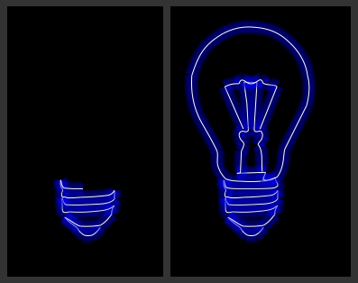

## Animated Glowing Line Drawing [Back](./../canvas.md)

Before what we talk, we can see a screen shot of it:


A few random parameters are first set up to determine the color of the line, as well as it's start and end points, and the control points, then a window interval just calls a function which draws a series of lines in decreasing thicknesses in the highlight color, followed by one thin white line on top.

```html
<canvas id="glow" width="600" height="400">
    Your browser does not support HTML5 Canvas.
</canvas>
```

```js
/**
 * update the position and direction of movement for an end point on the line or one of the control points
 */
function get_bounce_coord(coord_array) {
	coord_array[0] += step * coord_array[1];

	if( (coord_array[0] > (canv.height - 2 * step) && coord_array[2] === 'y') 
	    || (coord_array[0] > (canv.width - 2 * step) && coord_array[2] === 'x')
		|| coord_array[0] < 2 * step)	{
		coord_array[1] *= -1;
	}
}

function draw_line() {
	/** paint over the existing canvas */
	context.fillStyle = '#000';
	context.fillRect(0, 0, canv.width, canv.height);

	/** get the new coords based on each ones current trajectory */
	get_bounce_coord(x1);
	get_bounce_coord(y1);
	get_bounce_coord(x2);
	get_bounce_coord(y2);

	get_bounce_coord(cx1);
	get_bounce_coord(cy1);
	get_bounce_coord(cx2);
	get_bounce_coord(cy2);

	for (i = 5; i >= 0; i--) {
		context.beginPath();

		/** draw each line, the last line in each is always white */
		context.lineWidth = (i + 1) * 4 - 2;
		
		if (i === 0) {
			context.strokeStyle = '#fff';
		} else {
			context.strokeStyle = 'rgba(' + highlight[0] + ',' + highlight[1] + ',' + highlight[2] + ',0.2)';
		}
		
		context.moveTo(x1[0], y1[0]);
		context.bezierCurveTo(cx1[0],cy1[0],cx2[0],cy2[0],x2[0],y2[0]);
		context.stroke();
		context.closePath();
	}
}

/**
 * get a random x or y coordinate
 */
function random_coord(type) {
	dimension = (type === 'x') ? canv.width : canv.height;
	return Math.random() * (dimension - 2 * step) + step;
}

(function() {
    canv = document.getElementById('glow');
    
    if (!canv || !canv.getContext) {
        return;
    }
    
    context = canv.getContext('2d');
    
    /** the glow color */
    highlight = new Array(Math.round(Math.random() * 255), Math.round(Math.random() * 255), Math.round(Math.random() * 255));
	step = 7;   /** amount each movement of coord is in canvas pixels */
	
	/** start and end coordinates for the line */
	x1 = new Array(random_coord('x'), -1, 'x');
	y1 = new Array(random_coord('y'), 1, 'y');
	x2 = new Array(random_coord('x'), -1.5, 'x');
	y2 = new Array(random_coord('y'), -1.5, 'y');
	
	/** coordinates for the control points of the bezier curve */
	cx1 = new Array(random_coord('x'), 1, 'x');
	cy1 = new Array(random_coord('y'), -1, 'y');
	cx2 = new Array(random_coord('x'), -1, 'x');
	cy2 = new Array(random_coord('y'), 1, 'y');
	
	timer = window.setInterval(draw_line, 30);
})();
```

<br />

<iframe height='300' scrolling='no' src='//codepen.io/aleen42/embed/NRxJQE/?height=300&theme-id=21735&default-tab=result&embed-version=2' frameborder='no' allowtransparency='true' allowfullscreen='true' style='width: 100%;'>See the Pen <a href='http://codepen.io/aleen42/pen/NRxJQE/'>NRxJQE</a> by aleen42 (<a href='http://codepen.io/aleen42'>@aleen42</a>) on <a href='http://codepen.io'>CodePen</a>.
</iframe>

<br />

After that, there was an attempt at creating a simple animated drawing of a basic line art shape with the same glowing line technique.



Because I wanted to be able to see the shape being drawn it had to be as a series of steps which could be broken down into manageable chunks. I also wanted the code to be flexible enough that I could change the shape it was drawing whenever I liked, without having to code up a complex series of steps each time. These two requirements got me thinking about the shorthand notation of a path used in SVG which uses single letters followed by one or more pairs of coordinates to draw lines and curves. 

```nginx
M 161.70443,272.07413
C 148.01517,240.84549 134.3259,209.61686 120.63664,178.38822
C 132.07442,172.84968 139.59482,171.3636 151.84309,171.76866
```

That's basically a `moveTo` command followed by two `curveTo` commands.

As it turned out, that wasn't too difficult, and this is the result of that parser:

```js
var currentPoint = 0;
var nextPoint = 0;

function animateDrawing() {
    var points = path.split(' ');
	var draw_part = {
	    type: 'm',
	    buffer: new Array()
    };
    
    i = nextPoint;
    
    if (i >= points.length) {
        return false;
    } else {
        setTimeout(animateDrawing, 30);
    }
}
```
