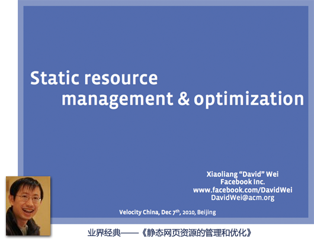
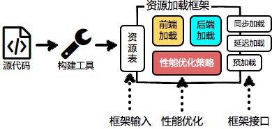

## [轉載] 前端工程 -- 基礎篇 [Back](./../post.md)

> - Author: [fouber · 張雲龍](https://github.com/fouber)
- Origin: https://github.com/fouber/blog/issues/10
- Time: Aug, 27th, 2015

<br />

> 評論: 一般地, 前端開發會遭到大部分人的輕視. 在許多人看來, 前端理應歸並到設計或產品中, 而且是一項較為容易上手的東西. 但是, 正如張雲龍所說, 前端遠不止這些. 上手容易, 深究難. 因此, 前端理應以一個獨立的工程概念去對待. - aleen42

## 前端，是一种GUI软件

现如今前端可谓包罗万象，产品形态五花八门，涉猎极广，什么高大上的基础库/框架，拽炫酷的宣传页面，还有屌炸天的小游戏……不过这些一两个文件的小项目并非是前端技术的主要应用场景，更具商业价值的则是复杂的Web应用，它们功能完善，界面繁多，为用户提供了完整的产品体验，可能是新闻聚合网站，可能是在线购物平台，可能是社交网络，可能是金融信贷应用，可能是音乐互动社区，也可能是视频上传与分享平台……

> 从本质上讲，所有Web应用都是一种运行在网页浏览器中的软件，这些软件的图形用户界面（Graphical User Interface，简称GUI）即为前端。

如此复杂的Web应用，动辄几十上百人共同开发维护，其前端界面通常也颇具规模，工程量不亚于一般的传统GUI软件：


尽管Web应用的复杂程度与日俱增，用户对其前端界面也提出了更高的要求，但时至今日仍然没有多少前端开发者会从软件工程的角度去思考前端开发，来助力团队的开发效率，更有甚者还对前端保留着”如玩具般简单“的刻板印象，日复一日，刀耕火种。

历史悠久的前端开发，始终像是放养的野孩子，原始如斯，不免让人慨叹！

## 前端工程的三个阶段

现在的前端开发倒也并非一无所有，回顾一下曾经经历过或听闻过的项目，为了提升其前端开发效率和运行性能，前端团队的工程建设大致会经历三个阶段：

### 第一阶段：库/框架选型


前端工程建设的第一项任务就是根据项目特征进行技术选型。

基本上现在没有人完全从0开始做网站，哪怕是政府项目用个jquery都很正常吧，React/Angularjs等框架横空出世，解放了不少生产力，合理的技术选型可以为项目节省许多工程量这点毋庸置疑。

### 第二阶段：简单构建优化


选型之后基本上就可以开始敲码了，不过光解决开发效率还不够，必须要兼顾运行性能。前端工程进行到第二阶段会选型一种构建工具，对代码进行压缩，校验，之后再以页面为单位进行简单的资源合并。

前端开发工程化程度之低，常常出乎我的意料，我之前在百度工作时是没有多少概念的，直到离开大公司的温室，去到业界与更多的团队交流才发现，能做到这个阶段在业界来说已然超出平均水平，属于“具备较高工程化程度”的团队了，查看网上形形色色的网页源代码，能做到最基本的JS/CSS压缩的Web应用都已跨入标准互联网公司行列，不难理解为什么很多前端团队对于前端工程构建的认知还仅停留在“压缩、校验、合并”这种程度。

### 第三阶段：JS/CSS模块化开发


分而治之是软件工程中的重要思想，是复杂系统开发和维护的基石，这点放在前端开发中同样适用。在解决了基本开发效率运行效率问题之后，前端团队开始思考维护效率，模块化是目前前端最流行的分治手段。

> 很多人觉得模块化开发的工程意义是复用，我不太认可这种看法，在我看来，模块化开发的最大价值应该是分治，是分治，分治！（重说三）。

> 不管你将来是否要复用某段代码，你都有充分的理由将其分治为一个模块。

JS模块化方案很多，AMD/CommonJS/UMD/ES6 Module等，对应的框架和工具也一大堆，说起来很烦，大家自行百度吧；CSS模块化开发基本都是在less、sass、stylus等预处理器的import/mixin特性支持下实现的。

虽然这些技术由来已久，在如今这个“言必及React”的时代略显落伍，但想想业界的绝大多数团队的工程化落后程度，放眼望去，毫不夸张的说，能达到第三阶段的前端团队已属于高端行列，基本具备了开发维护一般规模Web应用的能力。

然而，做到这些就够了么？Naive！

### 第四阶段

> 前端是一种技术问题较少、工程问题较多的软件开发领域。

当我们要开发一款完整的Web应用时，前端将面临更多的工程问题，比如：

- 大体量：多功能、多页面、多状态、多系统；
- 大规模：多人甚至多团队合作开发；
- 高性能：CDN部署、[缓存控制](https://developers.google.com/speed/docs/insights/LeverageBrowserCaching)、[文件指纹](https://developers.google.com/speed/docs/insights/LeverageBrowserCaching)、缓存复用、请求合并、按需加载、同步/异步加载、移动端[首屏CSS内嵌](https://developers.google.com/speed/docs/insights/mobile)、HTTP 2.0服务端[资源推送](http://chimera.labs.oreilly.com/books/1230000000545/ch12.html#HTTP2_PUSH)。

> 扩展阅读：[大公司里怎样开发和部署前端代码？](https://github.com/fouber/blog/issues/6)

这些无疑是一系列严肃的系统工程问题。

前面讲的三个阶段虽然相比曾经“茹毛饮血”的时代进步不少，但用于支撑第四阶段的多人合作开发以及精细的性能优化似乎还欠缺点什么。

到底，缺什么呢？

### 没有银弹

读过《[人月神话](http://book.douban.com/subject/2230248/)》的人应该都听说过，软件工程 [没有银弹](http://baike.baidu.com/view/277972.htm)。没错，前端开发同样没有银弹，可是现在是连™铅弹都没有的年月！（刚有了BB弹，摔）

前端历来以“简单”著称，在前端开发者群体中，小而美的价值观占据着主要的话语权，甚至成为了某种信仰，想与其他人交流一下工程方面的心得，得到的回应往往都是两个字：太重。

> 重你妹！你的脑容量只有4K吗？

工程方案其实也可以小而美！只不过它的小而美不是指代码量，而是指“规则”。找到问题的根源，用最少最简单明了的规则制定出最容易遵守最容易理解的开发规范或工具，以提升开发效率和工程质量，这同样是小而美的典范！

2011年我有幸参与到 [FIS](http://fis.baidu.com/) 项目中，与百度众多大中型项目的前端研发团队共同合作，不断探索实践前端开发的工程化解决方案，13年离开百度去往UC，面对完全不同的产品形态，不同的业务场景，不同的适配终端，甚至不同的网络环境，过往的方法论仍然能够快速落地，为多个团队的不同业务场景量身定制出合理的前端解决方案。

这些经历让我明悟了一个道理：

> 进入第四阶段，我们只需做好两件事就能大幅提升前端开发效率，并且兼顾运行性能，那就是——组件化开发与资源管理。

#### 第一件事：组件化开发

分治的确是非常重要的工程优化手段。在我看来，前端作为一种GUI软件，光有JS/CSS的模块化还不够，对于UI组件的分治也有着同样迫切的需求：


如上图，这是我所信仰的前端组件化开发理念，简单解读一下：

1. 页面上的每个 **独立的** 可视/可交互区域视为一个组件；
2. **每个组件对应一个工程目录**，组件所需的各种资源都在这个目录下**就近维护**；
3. 由于组件具有独立性，因此组件与组件之间可以 **自由组合**；
4. 页面只不过是组件的容器，负责组合组件形成功能完整的界面；
5. 当不需要某个组件，或者想要替换组件时，可以整个目录删除/替换。

其中第二项描述的就近维护原则，是我觉得最具工程价值的地方，它为前端开发提供了很好的分治策略，每个开发者都将清楚的知道，自己所开发维护的功能单元，其代码必然存在于对应的组件目录中，在那个目录下能找到有关这个功能单元的所有内部逻辑，样式也好，JS也好，页面结构也好，都在那里。

组件化开发具有较高的通用性，无论是前端渲染的单页面应用，还是后端模板渲染的多页面应用，组件化开发的概念都能适用。组件HTML部分根据业务选型的不同，可以是静态的HTML文件，可以是前端模板，也可以是后端模板：


> 不同的技术选型决定了不同的组件封装和调用策略。

基于这样的工程理念，我们很容易将系统以独立的组件为单元进行分工划分：


由于系统功能被分治到独立的模块或组件中，粒度比较精细，组织形式松散，开发者之间不会产生开发时序的依赖，大幅提升并行的开发效率，理论上允许随时加入新成员认领组件开发或维护工作，也更容易支持多个团队共同维护一个大型站点的开发。

结合前面提到的模块化开发，整个前端项目可以划分为这么几种开发概念：

名称|说明|举例
:--:|:---|:---
JS模块|独立的算法和数据单元|浏览器环境检测(detect)，网络请求(ajax)，应用配置(config)，DOM操作(dom)，工具函数(utils)，以及组件里的JS单元
CSS模块|独立的功能性样式单元|栅格系统(grid)，字体图标(icon-fonts)，动画样式(animate)，以及组件里的CSS单元
UI组件|独立的可视/可交互功能单元|页头(header)，页尾(footer)，导航栏(nav)，搜索框(search)
页面|前端这种GUI软件的界面状态，是UI组件的容器|首页(index)，列表页(list)，用户管理(user)
应用|整个项目或整个站点被称之为应用，由多个页面组成	

以上5种开发概念以相对较少的规则组成了前端开发的基本工程结构，基于这些理念，我眼中的前端开发就成了这个样子：

示意图|描述
:----:|:---
|整个Web应用由页面组成
|页面由组件组成
|一个组件一个目录，资源就近维护
|组件可组合，组件的JS可依赖其他JS模块，
CSS可依赖其他CSS单元

综合上面的描述，对于一般中小规模的项目，大致可以规划出这样的源码目录结构：


如果项目规模较大，涉及多个团队协作，还可以将具有相关业务功能的页面组织在一起，形成一个子系统，进一步将整个站点拆分出多个子系统来分配给不同团队维护，针对这种情况后面我会单开文章详细介绍。

以上架构设计历经许多不同公司不同业务场景的前端团队验证，收获了不错的口碑，是行之有效的前端工程分治方案。

> 吐槽：我本人非常反对某些前端团队将前端开发划分为“JS开发”和“页面重构”两种岗位，更倾向于组件粒度的开发理念，对GUI软件开发的分工规划应该以功能为单位，而不是开发语言；对开发者的技术要求也应该是掌握完整的端内技术。

### 第二件事：“智能”静态资源管理

上面提到的模块化/组件化开发，仅仅描述了一种开发理念，也可以认为是一种开发规范，倘若你认可这规范，对它的分治策略产生了共鸣，那我们就可以继续聊聊它的具体实现了。

> 很明显，模块化/组件化开发之后，我们最终要解决的，就是模块/组件加载的技术问题。然而前端与客户端GUI软件有一个很大的不同：

前端是一种远程部署，运行时增量下载的GUI软件
前端应用没有安装过程，其所需程序资源都部署在远程服务器，用户使用浏览器访问不同的页面来加载不同的资源，随着页面访问的增加，渐进式的将整个程序下载到本地运行，“增量下载”是前端在工程上有别于客户端GUI软件的根本原因。


上图展示了一款界面繁多功能丰富的应用，如果采用Web实现，相信也是不小的体量，如果用户第一次访问页面就强制其加载全站静态资源再展示，相信会有很多用户因为失去耐心而流失。根据“增量”的原则，我们应该精心规划每个页面的资源加载策略，使得用户无论访问哪个页面都能按需加载页面所需资源，没访问过的无需加载，访问过的可以缓存复用，最终带来流畅的应用体验。

这正是Web应用“免安装”的魅力所在。

由“增量”原则引申出的前端优化技巧几乎成为了性能优化的核心，有加载相关的按需加载、延迟加载、预加载、请求合并等策略；有缓存相关的浏览器缓存利用，缓存更新、缓存共享、非覆盖式发布等方案；还有复杂的BigRender、BigPipe、Quickling、PageCache等技术。这些优化方案无不围绕着如何将增量原则做到极致而展开。

所以我觉得：

>第四阶段前端开发最迫切需要做好的就是在基础架构中贯彻增量原则。

相信这种贯彻不会随着时间的推移而改变，在可预见的未来，无论在HTTP1.x还是HTTP2.0时代，无论在ES5亦或者ES6/7时代，无论是AMD/CommonJS/UMD亦或者ES6 module时代，无论端内技术如何变迁，我们都有足够充分的理由要做好前端程序资源的增量加载。

正如前面说到的，第三阶段前端工程缺少点什么呢？我觉得是在其基础架构中缺少这样一种“智能”的资源加载方案。没有这样的方案，很难将前端应用的规模发展到第四阶段，很难实现落地前面介绍的那种组件化开发方案，也很难让多方合作高效率的完成一项大型应用的开发，并保证其最终运行性能良好。在第四阶段，我们需要强大的工程化手段来管理”玩具般简单“的前端开发。

在我的印象中，Facebook是这方面探索的伟大先驱之一，早在2010年的[Velocity China大会](http://velocity.oreilly.com.cn/2010/)上，来自Facebook的[David Wei](http://davidwei.org/)博士就为业界展示了他们令人惊艳的[静态网页资源管理和优化技术](http://velocity.oreilly.com.cn/2010/index.php?func=session&name=%E9%9D%99%E6%80%81%E7%BD%91%E9%A1%B5%E8%B5%84%E6%BA%90%E7%9A%84%E7%AE%A1%E7%90%86%E5%92%8C%E4%BC%98%E5%8C%96)。

David Wei博士在当年的交流会上提到过一些关于Facebook的一些产品数据：

> - Facebook整站有10000+个静态资源；
- 每个静态资源都有可能被翻译成超过100种语言版本；
- 每种资源又会针对浏览器生成3种不同的版本；
- 要针对不同带宽的用户做5种不同的打包方法；
- 有3、4个不同的用户组，用于小批次体验新的产品功能；
- 还要考虑不同的送达方法，可以直接送达，或者通过iframe的方式提升资源并行加载的速度；
- 静态资源的压缩和非压缩状态可切换，用于调试和定位线上问题


这是一个状态爆炸的问题，将所有状态乘起来，整个网站的资源组合方式会达到几百万种之多（去重之后统计大概有300万种组合方式）。支撑这么大规模前端项目运行的底层架构正是魏博士在那次演讲中分享的[Static Resource Management System](http://velocity.oreilly.com.cn/2010/ppts/VelocityChina2010Dec7StaticResource.pdf)(静态资源管理系统)，用以解决Facebook项目中有关前端工程的3D问题（Development，Deployment，Debugging）。



那段时间 [FIS](http://fis.baidu.com/) 项目正好遇到瓶颈，当时的FIS还是一个用php写的task-based构建工具，那时候对于前端工程的认知度很低，觉得前端构建不就是几个压缩优化校验打包任务的组合吗，写好流程调度，就针对不同需求写插件呗，看似非常简单。但当我们支撑越来越多的业务团队，接触到各种不同的业务场景时，我们深刻的感受到task-based工具的粗糙，团队每天疲于根据各种业务场景编写各种打包插件，构建逻辑异常复杂，隐隐看到不可控的迹象。

我们很快意识到把基础架构放到构建工具中实现是一件很愚蠢的事，试图依靠构建工具实现各种优化策略使得构建变成了一个巨大的黑盒，一旦发生问题，定位起来非常困难，而且每种业务场景都有不同的优化需求，构建工具只能通过静态分析来优化加载，具有很大的局限性，单页面/多页面/PC端/移动端/前端渲染/后端渲染/多语言/多皮肤/高级优化等等资源加载问题，总不能给每个都写一套工具吧，更何况这些问题彼此之间还可以有多种组合应用，工具根本写不过来。

Facebook的做法无疑为我们亮起了一盏明灯，不过可惜它并不开源（不是技术封锁，而是这个系统依赖FB体系中的其他方面，通用性不强，开源意义不大），我们只能尝试挖掘相关信息，网上对它的完整介绍还是非常非常少，分析facebook的前端代码也没有太多收获，后来无意中发现了facebook使用的项目管理工具[phabricator](http://phabricator.org/)中的一个静态管理方案[Celerity](https://secure.phabricator.com/book/phabdev/article/celerity/)，以及相关的[说明](https://secure.phabricator.com/book/phabflavor/article/soon_static_resources/)，看它的描述很像是Facebook静态资源管理系统的一个mini版！

简单看过整个系统之后发现原理并不复杂（小而美的典范），它是通过一个小工具扫描所有静态资源，生成一张资源表，然后有一个PHP实现的资源管理框架（Celerity）提供了资源加载接口，替代了传统的script/link等静态的资源加载标签，最终通过查表来加载资源。

虽然没有真正看过FB的那套系统，但眼前的这个小小的框架给了当时的我们足够多的启示：

> 静态资源管理系统 = 资源表 + 资源加载框架

多么优雅的实现啊！

资源表是一份数据文件（比如JSON），是项目中所有静态资源（主要是JS和CSS）的构建信息记录，通过构建工具扫描项目源码生成，是一种k-v结构的数据，以每个资源的id为key，记录了资源的类别、部署路径、依赖关系、打包合并等内容，比如：

```json
{
    "a.js": {
        "url": "/static/js/a.5f100fa.js",
        "dep": [ "b.js", "a.css" ]
    },
    "a.css": {
        "url": "/static/css/a.63cf374.css",
        "dep": [ "button.css" ]
    },
    "b.js": {
        "url": "/static/js/b.97193bf.js"
    },
    "button.css": {
        "url": "/static/css/button.de33108.css"
    }
}
```

而资源加载框架则提供一些资源引用的API，让开发者根据id来引用资源，替代静态的script/link标签来收集、去重、按需加载资源。调用这些接口时，框架通过查表来查找资源的各项信息，并递归查找其依赖的资源的信息，然后我们可以在这个过程中实现各种性能优化算法来“智能”加载资源。

根据业务场景的不同，加载框架可以在浏览器中用JS实现，也可以是后端模板引擎中用服务端语言实现，甚至二者的组合，不一而足。



> 有关加载框架的具体实现我曾写过很多文章介绍，可以扩展阅读：
- [前端工程与性能优化](https://github.com/fouber/blog/issues/3)
- [前端工程与模块化框架](https://github.com/fouber/blog/issues/4)

这种设计很快被验证具有足够的灵活性，能够完美支撑不同团队不同技术规范下的性能优化需求，前面提到的按需加载、延迟加载、预加载、请求合并、文件指纹、CDN部署、Bigpipe、Quickling、BigRender、首屏CSS内嵌、HTTP 2.0服务端推送等等性能优化手段都可以很容易的在这种架构上实现，甚至可以根据性能日志自动进行优化（Facebook已实现）。

因为有了资源表，我们可以很方便的控制资源加载，通过各种手段在运行时计算页面的资源使用情况，从而获得最佳加载性能。无论是前端渲染的单页面应用，还是后端渲染的多页面应用，这种方法都同样适用。

此外，它还很巧妙的约束了构建工具的职责——只生成资源表。资源表是非常通用的数据结构，无论什么业务场景，其业务代码最终都可以被扫描为相同结构的表数据，并标记资源间的依赖关系，有了表之后我们只需根据不同的业务场景定制不同的资源加载框架就行了，从此彻底告别一个团队维护一套工具的时代！！！


> 恩，如你所见，虽然彻底告别了一个团队一套工具的时代，但似乎又进入了一个团队一套框架的时代。其实还是有差别的，因为框架具有很大的灵活性，而且不那么黑盒，采用框架实现资源管理相比构建更容易调试、定位和升级变更。

深耕静态资源加载框架可以带来许多收益，而且有足够的灵活性和健壮性面向未来的技术变革，这个我们留作后话。

## 总结

回顾一下前面提到过的前端工程三个阶段：

- 第一阶段：库/框架选型
- 第二阶段：简单构建优化
- 第三阶段：JS/CSS模块化开发

现在补充上第四阶段：

第四阶段：组件化开发与资源管理

由于先天缺陷，前端相比其他软件开发，在基础架构上更加迫切的需要组件化开发和资源管理，而解决资源管理的方法其实一点也不复杂：

> 一个通用的资源表生成工具 + 基于表的资源加载框架

近几年来各种你听到过的各种资源加载优化策略大部分都可以在这样一套基础上实现，而这种优化对于业务来说是完全透明的，不需要重构的性能优化——这不正是我们一直所期盼的吗？正如魏小亮博士所说：我们可以把优秀的人集中起来去优化加载。

如何选型技术、如何定制规范、如何分治系统、如何优化性能、如何加载资源，当你从切图开始转变为思考这些问题的时候，我想说：

你好，工程师！

-----

> 前端工程其实是一个很大的话题，开发仅是其中的一部分。

相关文章：

- [前端工程——工具篇](https://github.com/fouber/blog/issues/10#)
- [前端工程——框架篇](https://github.com/fouber/blog/issues/10#)
- [前端工程——架构篇](https://github.com/fouber/blog/issues/10#)
- [前端工程——流程篇](https://github.com/fouber/blog/issues/10#)
- [前端工程——监控篇](https://github.com/fouber/blog/issues/10#)
- [前端工程——测试篇](https://github.com/fouber/blog/issues/10#)