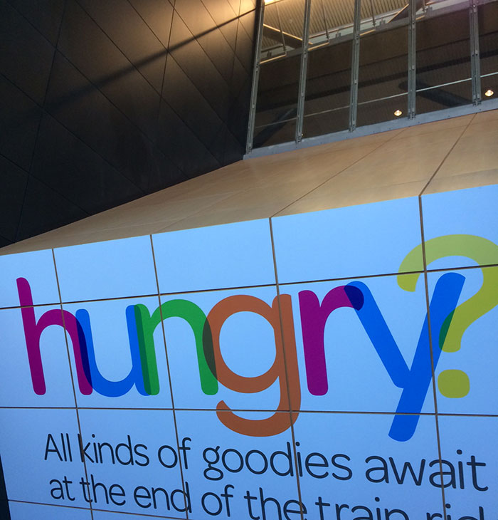

## [轉載] Basics of CSS Blend Modes [Back](./../post.md)

> - Author: [Chris Coyier](https://css-tricks.com/author/chriscoyier/)
- Origin: https://css-tricks.com/basics-css-blend-modes/
- Time: Feb, 28th, 2014

Bennett Feely has been doing a good job of [showing people the glory of CSS blend modes](./../css_blend_mode/css_blend_mode.md). There are lots of designerly effects that we're used to seeing in static designs (thanks to Photoshop) that we don't see on the web much, with dynamic content. But that will change as CSS blend modes get more support. I'd like to look at the different ways of doing it, since it's not exactly cut and dry.

### CSS Multiple Backgrounds Blend Modes

You can blend `background-images` together, or blend them with background-color. It's a simple as:

```css
.blended {
    background-image: url(face.jpg);
    background-color: red;
    background-blend-mode: multiply;
}
```

<iframe height='300' scrolling='no' src='//codepen.io/aleen42/embed/rrBJQx/?height=300&theme-id=21735&default-tab=css,result&embed-version=2' frameborder='no' allowtransparency='true' allowfullscreen='true' style='width: 100%;'>See the Pen <a href='http://codepen.io/aleen42/pen/rrBJQx/'>Background Blending</a> by aleen42 (<a href='http://codepen.io/aleen42'>@aleen42</a>) on <a href='http://codepen.io'>CodePen</a>.
</iframe>

`multiply` is a nice and useful one, but there is also: `screen`, `overlay`, `darken`, `lighten`, `color-dodge`, `color-burn`, `hard-light`, `soft-light`, `difference`, `exclusion`, `hue`, `saturation`, `color`, and `luminosity`. And also `normal` which reset it.

Adobe (who works on [the spec](http://dev.w3.org/fxtf/compositing-1/) for this stuff, of course) created this Pen for playing with the different possibilities here:

<iframe height='550' scrolling='no' src='//codepen.io/adobe/embed/FeiCp/?height=550&theme-id=21735&default-tab=html,result&embed-version=2' frameborder='no' allowtransparency='true' allowfullscreen='true' style='width: 100%;'>See the Pen <a href='http://codepen.io/adobe/pen/FeiCp/'>CSS Element Background Blend Modes</a> by Adobe Web Platform (<a href='http://codepen.io/adobe'>@adobe</a>) on <a href='http://codepen.io'>CodePen</a>.
</iframe>

A single element can have more than one background, [stacked up](http://css-tricks.com/stacking-order-of-multiple-backgrounds/). Like:

```css
.graphic-or-whatever {
    background:
        url(grid.png),
        url(building.jpg)
}
```

Those can blend too simply by adding a `background-blend-mode`.

<iframe height='300' scrolling='no' src='//codepen.io/aleen42/embed/GjKQbP/?height=300&theme-id=21735&default-tab=css,result&embed-version=2' frameborder='no' allowtransparency='true' allowfullscreen='true' style='width: 100%;'>See the Pen <a href='http://codepen.io/aleen42/pen/GjKQbP/'>Multiple Background Blending</a> by aleen42 (<a href='http://codepen.io/aleen42'>@aleen42</a>) on <a href='http://codepen.io'>CodePen</a>.
</iframe>

### Arbitrary HTML Elements Blend Modes

Blending backgrounds together is pretty cool, but personally I'm less excited about that than I am about blending arbitrary HTML elements together. Like a `<h1>` title over a background, for example. Or even text over text.

I saw this at an airport the other day and snapped a pic because I thought it looked neat and figured I could figure out how to do it on the web:



My first attempt to recreate it, I used opacity. But opacity really dulls the colors and doesn't make those overlapping bits have the extra darkness they should have. CJ Gammon [showed me](http://codepen.io/cjgammon/pen/nEzpj) there is a blending property precisely for this purpose: `mix-blend-mode`.

So to reproduce this:

```html
<h1>hungry?</h1>
```

Then break it up into ` `s with Lettering.js:

```js
$("h1").lettering();
```

Then squeeze the letters together with negative letter-spacing, set the `mix-blend-mode`, and colorize:

```css
h1 {
    font-size: 7rem;
    font-weight: 700;
    letter-spacing: -1.25rem;
}

h1 span {
    mix-blend-mode: multiply;
}
h1 span:nth-child(1) {
    color: rgba(#AB1795, 0.75);
}
/* etc, on coloring */
```

<iframe height='379' scrolling='no' src='//codepen.io/aleen42/embed/mAbxya/?height=379&theme-id=21735&default-tab=css,result&embed-version=2' frameborder='no' allowtransparency='true' allowfullscreen='true' style='width: 100%;'>See the Pen <a href='http://codepen.io/aleen42/pen/mAbxya/'>Overlapping Letters</a> by aleen42 (<a href='http://codepen.io/aleen42'>@aleen42</a>) on <a href='http://codepen.io'>CodePen</a>.
</iframe>

Like I mentioned, real web text over image is a pretty sweet use case if you ask me:

<iframe height='300' scrolling='no' src='//codepen.io/aleen42/embed/RGbrPq/?height=300&theme-id=21735&default-tab=css,result&embed-version=2' frameborder='no' allowtransparency='true' allowfullscreen='true' style='width: 100%;'>See the Pen <a href='http://codepen.io/aleen42/pen/RGbrPq/'>RGbrPq</a> by aleen42 (<a href='http://codepen.io/aleen42'>@aleen42</a>) on <a href='http://codepen.io'>CodePen</a>.
</iframe>

### Canvas Blend Modes

The DOM blend mode stuff is most interesting to me, but it should be noted that `<canvas>` has blend modes as well and it has a bit deeper support (see below for all that).

You set it on the canvas context. So like:

```js
var canvas = document.getElementById('canvas');
var ctx = canvas.getContext('2d');

ctx.globalCompositeOperation = 'multiply';
```

That value can be any of those I listed above. Here's a simple demo:

<iframe height='300' scrolling='no' src='//codepen.io/chriscoyier/embed/Kkliq/?height=300&theme-id=21735&default-tab=result&embed-version=2' frameborder='no' allowtransparency='true' allowfullscreen='true' style='width: 100%;'>See the Pen <a href='http://codepen.io/chriscoyier/pen/Kkliq/'>canvas blend modes</a> by Chris Coyier (<a href='http://codepen.io/chriscoyier'>@chriscoyier</a>) on <a href='http://codepen.io'>CodePen</a>.
</iframe>

And a fancy one where you can see the blending give the demo life:

<iframe height='300' scrolling='no' src='//codepen.io/soulwire/embed/foktm/?height=300&theme-id=21735&default-tab=js,result&embed-version=2' frameborder='no' allowtransparency='true' allowfullscreen='true' style='width: 100%;'>See the Pen <a href='http://codepen.io/soulwire/pen/foktm/'>sketch.js Demo</a> by Justin Windle (<a href='http://codepen.io/soulwire'>@soulwire</a>) on <a href='http://codepen.io'>CodePen</a>.
</iframe>
