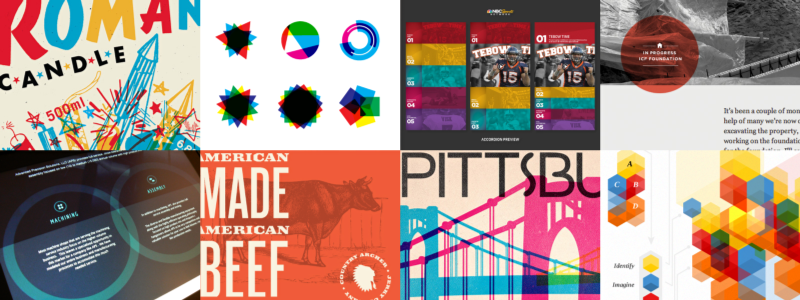

## [轉載] CSS Blend Modes could be the next big thing in Web Design [Back](./../post.md)

> - Author: [Bennett Feely](https://medium.com/@bennettfeely)
- Origin: https://medium.com/@bennettfeely/css-blend-modes-could-be-the-next-big-thing-in-web-design-6b51bf53743a#.cmprev5a6
- Time: Dec, 22nd, 2013

### Coming to a browser near you.

For everyone who has ever opened Photoshop or Illustrator you are most likely familiar with blend modes. `multiply`, `screen`, `overlay`, and `soft light`, to name a few can turn boring opaque layers into beautiful pieces of stained glass. However, what awesome "blend modes" do web designers have at their disposal for making websites beautiful? **Opacity**. Yep, that's it.

> Cool-looking things that are difficult or downright impossible to replicate in CSS right now. Top row: Doublenaut, Graham Hicks, Jonathan Quintin, and Geoff Teehan. Bottom row: Ben Johnson, Claire Morales, Alan Defibaugh, and Jess Barlow.

### Blend modes and the web

It's a shame that we couldn't have had more blend modes to work with when the `opacity` property gained widespread support across browsers, but it turns out that ensuring Photoshop-like blend modes render uniformly across different browsers and implementations is [no easy task](http://dbaron.org/log/20130306-compositing-blending). Some blend modes have been available in SVG through filters, but these are limited and don't see much use in the real world.

Despite this, things are changing fast and there is a candidate recommendation titled [CSS Compositing and Blending](http://dev.w3.org/fxtf/compositing-1/). Blend modes in CSS have been [promoted heavily](http://html.adobe.com/webplatform/graphics/blendmodes/) by Adobe Web Platform team (along with other interesting features like CSS [filters](http://blogs.adobe.com/webplatform/category/features/css-custom-filters/) and [masking](http://blogs.adobe.com/webplatform/category/features/masking/)).

Right now, the specification brings three brand new properties to CSS, `background-blend-mode`, mix-blend-mode, and isolation. Let's explore!

### Canvas 2D: Will it blend?

> Particles by Justin Windle. Blend modes make this awesome demo really pop.

First, here's a little secret, blend modes are now available for use with HTML5 Canvas in [all the latest browsers](http://caniuse.com/canvas-blending) except Internet Explorer. They are even supported on iOS Safari and mobile versions of Chrome. However, why should we stop there? Blend modes would be incredibly useful in CSS.

### Blending in CSS: Say hello to background-blend-mode

> Sixteen blend modes are coming to CSS. Demo.

The new background-blend-mode property allows you to specify blending between background layers of an element. Whether it be between an element's background-color and background-image, or a background-image CSS gradient, background-blend-mode mixes all the backgrounds together with the blend mode(s) you specify. CSS gradients can be blended together to produce many [fast-loading backgrounds](http://bennettfeely.com/gradients) for websites or elements.

> Medium even uses blend modes in their articles. Too bad our friend CSS isn't there to make this process a lot faster and easier.

Don't think this property would get much use? Don't go further than the website you're on right now. When uploading full-page backgrounds to an article, Medium gives you the option to apply a color to the background to make the title stand out a bit more. However, because browsers don't have blend modes in CSS, Medium has to do this the slow and costly way. They make six copies of the image you upload with different colors applied to each one, a process done on the server side. For the reader, this method is a lot slower than it could be with background-blend-mode. This new property could also be utilized elsewhere:

> The Verge's website is unique partly because of the pseudo blend modes they apply on their headlines. background-blend-mode could likely be used to make these kind of effects even better.

The background-blend-mode property can also be [used to make new CSS gradients](http://bennettfeely.com/gradients/) that were not possible before.

### The super duper mix-blend-mode property

While background-blend-mode is strictly for blending backgrounds, we'd ideally also like to blend HTML and SVG elements like layers on a .psd. Fortunately, that is where the mix-blend-mode property comes in.

mix-blend-mode will blend elements with their backdrop. Perhaps you could experiment with a [header that utilizes the screen blend mode](http://codepen.io/bennettfeely/pen/oCHAf) rather than a simple background color with rgba(). There are also probably an infinite number of possibilities with [loading animations and blend modes](http://codepen.io/bennettfeely/pen/Cvcyi). The isolation property stops elements with mix-blend-mode from blending with the backdrop.

Implementation of the mix-blend-mode property is more complex than background-blend-mode so it is taking a bit more time, but don't let that get you down. Blend modes will be here soon!

###　Can I use blend modes now?

- **Chrome**: Supports background-blend-mode and mix-blend-mode.
- **Firefox**: Supports background-blend-mode and mix-blend-mode.
- **Safari**: Supports background-blend-mode and mix-blend-mode on desktop and mobile. However, does not yet support hue, saturation, color, luminosity blend modes.
- **Opera**: Supports background-blend-mode and mix-blend-mode.
- **Internet Explorer**: background-blend-mode and mix-blend-mode are not supported and listed as "[under consideration](https://dev.windows.com/en-us/microsoft-edge/platform/status/backgroundblendmode?filter=f3f0000bf&search=blend)" with a "low" priority. Canvas blend modes are supported.