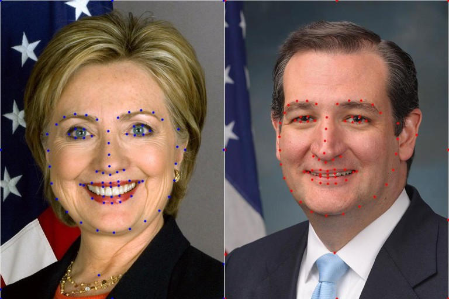
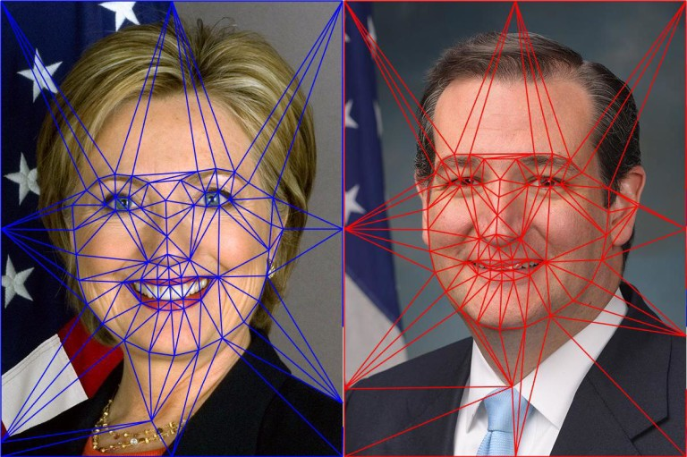
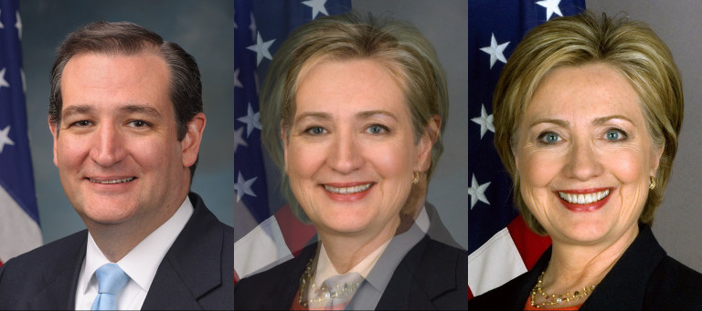
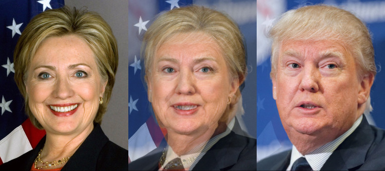

## [轉載] Face Morph Using OpenCV — C++ / Python [Back](./../post.md)

> - Author: [SATYA MALLICK](http://www.learnopencv.com/about/)
- Origin: http://www.learnopencv.com/face-morph-using-opencv-cpp-python/
- Time: Mar, 11st, 2016

In this tutorial we will learn how to morph one face into another using OpenCV.

I have chosen to use the photos of the top three American Presidential candidates, but this is not a political post and I have no political agenda. And yes, that is the prettiest picture of Donald Trump I could find!

> You can [download](http://www.learnopencv.com/face-morph-using-opencv-cpp-python/#download) the code and images used in this post by subscribing to our newsletter [here](http://www.learnopencv.com/face-morph-using-opencv-cpp-python/#download).

In my previous posts I have covered [Facial Landmark Detection](http://www.learnopencv.com/facial-landmark-detection/) and [Delaunay Triangulation](http://www.learnopencv.com/delaunay-triangulation-and-voronoi-diagram-using-opencv-c-python/). It is a good idea to review those posts to better understand this one.

### Image Morphing

Image morphing was first used extensively in the movie Willow using a technique developed at Industrial Light and Magic. A scene from the movie is shown below.

The idea behind Image Morphing is rather simple. Given two images $$I$$ and $$J$$ we want to create an in-between image $$M$$ by blending images $$I$$ and $$J$$. The blending of images $$I$$ and $$J$$ is controlled by a parameter $$\alpha$$ that is between 0 and 1 $$( 0 \leq \alpha \leq 1 )$$. When $$\alpha$$ is 0, the morph $$M$$ looks like $$I$$, and when $$\alpha$$ is 1, $$M$$ looks exactly like $$J$$. Naively, you can blend the images using the following equation at every pixel $$(x, y)$$

$$M (x, y) = ( 1 - \alpha ) I (x, y) + \alpha J (x , y)$$

However, using the above equation to generate a blend between the image of Secretary Hillary Clinton and Senator Ted Cruz with $$\alpha$$ set to 0.5, you will get the following terrible results.

The resulting image is disturbing, but it also screams a solution at you. It begs you to somehow align the eyes and the mouth before blending the images. You get similar disturbing results when you try to blend two different political ideologies without first aligning the minds, but I digress.

So, to morph image $$I$$ into image $$J$$ we need to first establish pixel correspondence between the two images. In other words, for every pixel $$(x_i, y_i)$$ in image $$I$$, we need to find it’s corresponding pixel $$(x_j, y_j)$$ in image $$J$$. Suppose we have magically found these correspondences, we can blend the images in two steps. First, we need to calculate the location $$(x_m, y_m)$$ of the pixel in the morphed image. It is given by the following equation

$$\begin{align*}  x_m &= (1 - \alpha) x_i + \alpha x_j \\ y_m &= (1 - \alpha) y_i + \alpha y_j \end{align*}$$

Second, we need to find the intensity of the pixel at (x_m, y_m) using the following equation

$$\begin{equation*} M(x_m,y_m) = (1 - \alpha) I(x_i, y_i) + \alpha J(x_j, y_j) \end{equation*}$$

That’s it. We are done. Now, Let’s go and vote for Trump. Kidding! Just like Trump, I left out some important details. Finding a corresponding point in image J for every pixel in image I is about as difficult as building a 10 ft wall between the United States and Mexico. It can be done, but it is expensive and not really necessary.

But it is very easy to find a few point correspondences. For morphing two dissimilar objects, like a cat’s face and a human’s face, we can click on a few points on the two images to establish correspondences and interpolate the results for the rest of the pixels. We will next see how Face Morphing is done in detail, but the same technique can be applied to any two objects.

### Face Morphing : Step by Step

Morphing two faces can be done using the following steps. For simplicity, we will assume the images are of the same size, but it is not a necessity.

#### 1. Find Point Correspondences using Facial Feature Detection

Let’s start by obtaining corresponding points. First, we can get a lot of points by automatically ( or manually ) by [detecting facial feature points](http://www.learnopencv.com/facial-landmark-detection/). I used dlib to detect 68 corresponding points. Next, I added four more points ( one on the right hand side ear, one on the neck, and two on the shoulders ). Finally, I added the corners of the image and half way points between those corners as corresponding points as well. Needless to say, one can add a few more points around the head and neck to get even better results, or remove the manually clicked points to get slightly worse ( but fully automatic ) results.

#### 2. Delaunay Triangulation

From the previous step we have two sets of 80 points — one set per image. We can calculate the average of corresponding points in the two sets and obtain a single set of 80 points. On this set of average points we perform [Delaunay Triangulation](http://www.learnopencv.com/delaunay-triangulation-and-voronoi-diagram-using-opencv-c-python/). The result of Delaunay triangulation is a list of triangles represented by the indices of points in the 80 points array. In this particular case the triangulation produces 149 triangles connecting the 80 points. The triangulation is stored as an array of three columns. The first few rows of the triangulation is shown below.

> Triangulation

> 38 40 37

> 35 30 29

> 38 37 20

> 18 37 36

> 33 32 30

> …

It shows that points 38, 40 and 37 form a triangle and so on. The triangulation is shown on the two images below.

Notice the triangles in the two images capture approximately similar regions. We had started with point correspondences and now, because of triangulation, we have triangle ( or region ) correspondences.

#### 3. Warping images and alpha blending

> To understand the description below better, [download](http://www.learnopencv.com/face-morph-using-opencv-cpp-python/#download) the code and images by subscribing to our newsletter [here](http://www.learnopencv.com/face-morph-using-opencv-cpp-python/#download).

We are now in a position to intelligently blend the two images. As mentioned before, the amount of blending will be controlled by a parameter $$\alpha$$. Create a morph using the following steps.

1. **Find location of feature points in morphed image** : In the morphed image M, we can find the locations of all 80 points $$(x_m, y_m)$$ using equation (1).
2. **Calculate affine transforms** : So we have a set of 80 points in image 1, another set of 80 points in image 2 and a third set of 80 points in the morphed image. We also know the triangulation defined over these points. Pick a triangle in image 1 and the corresponding triangle in the morphed image and calculate the affine transform that maps the three corners of the triangle in image 1 to the three corners of the corresponding triangle in the morphed image. In OpenCV, this can be done using **getAffineTransform** . Calculate an affine transform for every pair of 149 triangles. Finally, repeat the process of image 2 and the morphed image.
3. **Warp triangles** : For each triangle in image 1, use the affine transform calculated in the previous step to transform all pixels inside the triangle to the morphed image. Repeat this for all triangles in image 1 to obtain a warped version of image 1. Similarly, obtain a warped version for image 2. In OpenCV this is achieved by using the function **warpAffine**. However, warpAffine takes in an image and not a triangle. The trick is to calculate a bounding box for the triangle, warp all pixels inside the bounding box using warpAffine, and then mask the pixels outside the triangle. The triangular mask is created using **fillConvexPoly**. Be sure to use blendMode BORDER_REFLECT_101 while using warpAffine. It hides the seams better than Secretary Clinton hides her emails.
4. **Alpha blend warped images** : In the previous step we obtained warped version of image 1 and image 2. These two images can be alpha blended using equation (2), and this is your final morphed image. In the code I have provided warping triangles and alpha blending them is combined in a single step.

### Face Morphing Results

The results of applying the above technique are shown below. The image in the center is a 50% blend of the image on the left and the right. The video on the top of this page shows an animation with different alpha values. Animation is a cheap trick that hides a lot of flaws in a morph; Senator Ted Cruz would love it.

Most facial features are very well aligned. The part of the image outside the face is not so well aligned because we have fewer corresponding points in that region. One can manually add additional points to fix mis-alignments and get better results.

