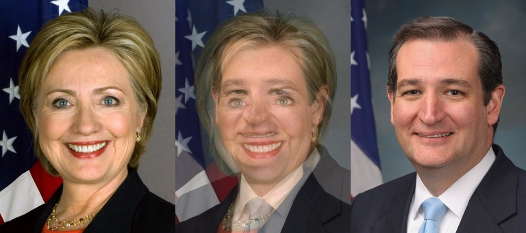

## [轉載] Face Morph Using OpenCV — C++ / Python [Back](./../post.md)

> - Author: [SATYA MALLICK](http://www.learnopencv.com/about/)
- Origin: http://www.learnopencv.com/face-morph-using-opencv-cpp-python/
- Time: Mar, 11st, 2016

In this tutorial we will learn how to morph one face into another using OpenCV.

I have chosen to use the photos of the top three American Presidential candidates, but this is not a political post and I have no political agenda. And yes, that is the prettiest picture of Donald Trump I could find!

> You can [download](http://www.learnopencv.com/face-morph-using-opencv-cpp-python/#download) the code and images used in this post by subscribing to our newsletter [here](http://www.learnopencv.com/face-morph-using-opencv-cpp-python/#download).

In my previous posts I have covered [Facial Landmark Detection](http://www.learnopencv.com/facial-landmark-detection/) and [Delaunay Triangulation](http://www.learnopencv.com/delaunay-triangulation-and-voronoi-diagram-using-opencv-c-python/). It is a good idea to review those posts to better understand this one.

### Image Morphing

Image morphing was first used extensively in the movie Willow using a technique developed at Industrial Light and Magic. A scene from the movie is shown below.

The idea behind Image Morphing is rather simple. Given two images $$I$$ and $$J$$ we want to create an in-between image $$M$$ by blending images $$I$$ and $$J$$. The blending of images $$I$$ and $$J$$ is controlled by a parameter $$\alpha$$ that is between 0 and 1 $$( 0 \leq \alpha \leq 1 )$$. When $$\alpha$$ is 0, the morph $$M$$ looks like $$I$$, and when $$\alpha$$ is 1, $$M$$ looks exactly like $$J$$. Naively, you can blend the images using the following equation at every pixel $$(x, y)$$

$$M (x, y) = ( 1 - \alpha ) I (x, y) + \alpha J (x , y)$$

However, using the above equation to generate a blend between the image of Secretary Hillary Clinton and Senator Ted Cruz with $$\alpha$$ set to 0.5, you will get the following terrible results.

The resulting image is disturbing, but it also screams a solution at you. It begs you to somehow align the eyes and the mouth before blending the images. You get similar disturbing results when you try to blend two different political ideologies without first aligning the minds, but I digress.

So, to morph image $$I$$ into image $$J$$ we need to first establish pixel correspondence between the two images. In other words, for every pixel $$(x_i, y_i)$$ in image $$I$$, we need to find it’s corresponding pixel $$(x_j, y_j)$$ in image $$J$$. Suppose we have magically found these correspondences, we can blend the images in two steps. First, we need to calculate the location $$(x_m, y_m)$$ of the pixel in the morphed image. It is given by the following equation

$$\begin{align*}  x_m &= (1 - \alpha) x_i + \alpha x_j \\ y_m &= (1 - \alpha) y_i + \alpha y_j \end{align*}$$

Second, we need to find the intensity of the pixel at (x_m, y_m) using the following equation

$$\begin{equation*} M(x_m,y_m) = (1 - \alpha) I(x_i, y_i) + \alpha J(x_j, y_j) \end{equation*}$$