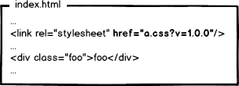
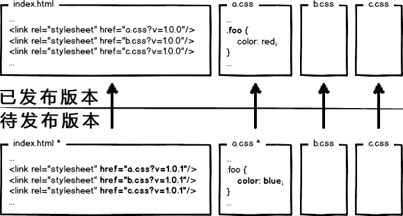
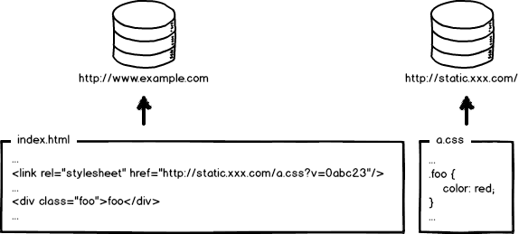
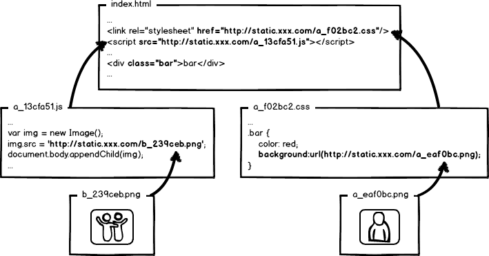

## [轉載] 大公司裏怎麼開發和部署前端代碼 [Back](./../post.md)

> - Author: [fouber · 張雲龍](https://github.com/fouber)
- Origin: https://github.com/fouber/blog/issues/6 
- Time: Nov, 1st, 2014

 

> 評論: 匠心精神, 正是如今大多數創業公司乃至中小型企業所缺乏的一種企業氛圍. 因此, 為何會有大量的技術人才想要湧向該類大型企業, 去深究技術的本質. 在較小型企業, 公司往往不會給予過多學習的時間, 而只在乎項目的進度. 只要表面上沒有太大的問題, 就立刻進行下一個不相關項目的開發. 因此, 在此類公司工作, 給予我最大的感覺就是: 只能把精力停留在公司的業務邏輯開發, 而並沒有過多得到技術的本質. 簡單來說, 就是公司正在消耗著你的價值, 而員工自身的價值卻沒有得到太大的提高.  -- aleen42

 

> 本文搬运自我在知乎上 同名问题 中的答案。

这是一个非常有趣的 `非主流前端领域`，这个领域要探索的是如何用工程手段解决前端开发和部署优化的综合问题，入行到现在一直在学习和实践中。

在我的印象中，facebook是这个领域的鼻祖，有兴趣、有梯子的同学可以去看看facebook的页面源代码，体会一下什么叫工程化。

接下来，我想从原理展开讲述，多图，较长，希望能有耐心看完。

----

让我们返璞归真，从原始的前端开发讲起。上图是一个“可爱”的index.html页面和它的样式文件a.css，用文本编辑器写代码，无需编译，本地预览，确认OK，丢到服务器，等待用户访问。前端就是这么简单，好好玩啊，门槛好低啊，分分钟学会有木有！

然后我们访问页面，看到效果，再查看一下网络请求，200！不错，太™完美了！那么，研发完成。。。。了么？

等等，这还没完呢！对于大公司来说，那些变态的访问量和性能指标，将会让前端一点也不“好玩”。

看看那个a.css的请求吧，如果每次用户访问页面都要加载，是不是很影响性能，很浪费带宽啊，我们希望最好这样：

利用304，让浏览器使用本地缓存。但，这样也就够了吗？不成！304叫协商缓存，这玩意还是要和服务器通信一次，我们的优化级别是变态级，所以必须彻底灭掉这个请求，变成这样：

强制浏览器使用本地缓存（cache-control/expires），不要和服务器通信。好了，请求方面的优化已经达到变态级别，那问题来了：你都不让浏览器发资源请求了，这缓存咋更新？

很好，相信有人想到了办法：**通过更新页面中引用的资源路径，让浏览器主动放弃缓存，加载新资源**。好像这样：

下次上线，把链接地址改成新的版本，就更新资源了不是。OK，问题解决了么？！当然没有！大公司的变态又来了，思考这种情况：

页面引用了3个css，而某次上线只改了其中的a.css，如果所有链接都更新版本，就会导致b.css，c.css的缓存也失效，那岂不是又有浪费了？！

重新开启变态模式，我们不难发现，要解决这种问题，必须让url的修改与文件内容关联，也就是说，只有文件内容变化，才会导致相应url的变更，从而实现文件级别的精确缓存控制。

什么东西与文件内容相关呢？我们会很自然的联想到利用 [数据摘要要算法](http://baike.baidu.com/view/10961371.htm) 对文件求摘要信息，摘要信息与文件内容一一对应，就有了一种可以精确到单个文件粒度的缓存控制依据了。好了，我们把url改成带摘要信息的：

这回再有文件修改，就只更新那个文件对应的url了，想到这里貌似很完美了。你觉得这就够了么？大公司告诉你：图样图森破！

唉~~~~，让我喘口气

现代互联网企业，为了进一步提升网站性能，会把静态资源和动态网页分集群部署，静态资源会被部署到CDN节点上，网页中引用的资源也会变成对应的部署路径：

好了，当我要更新静态资源的时候，同时也会更新html中的引用吧，就好像这样：

这次发布，同时改了页面结构和样式，也更新了静态资源对应的url地址，现在要发布代码上线，亲爱的前端研发同学，你来告诉我，咱们是先上线页面，还是先上线静态资源？

1. `先部署页面，再部署资源`：在二者部署的时间间隔内，如果有用户访问页面，就会在新的页面结构中加载旧的资源，并且把这个旧版本的资源当做新版本缓存起来，其结果就是：用户访问到了一个样式错乱的页面，除非手动刷新，否则在资源缓存过期之前，页面会一直执行错误。
2. `先部署资源，再部署页面`：在部署时间间隔之内，有旧版本资源本地缓存的用户访问网站，由于请求的页面是旧版本的，资源引用没有改变，浏览器将直接使用本地缓存，这种情况下页面展现正常；但没有本地缓存或者缓存过期的用户访问网站，就会出现旧版本页面加载新版本资源的情况，导致页面执行错误，但当页面完成部署，这部分用户再次访问页面又会恢复正常了。 好的，上面一坨分析想说的就是：先部署谁都不成！都会导致部署过程中发生页面错乱的问题。所以，访问量不大的项目，可以让研发同学苦逼一把，等到半夜偷偷上线，先上静态资源，再部署页面，看起来问题少一些。

但是，大公司超变态，没有这样的“绝对低峰期”，只有“相对低峰期”。So，为了稳定的服务，还得继续追求极致啊！

这个奇葩问题，起源于资源的 覆盖式发布，用 待发布资源 覆盖 已发布资源，就有这种问题。解决它也好办，就是实现 非覆盖式发布。

看上图，用文件的摘要信息来对资源文件进行重命名，把摘要信息放到资源文件发布路径中，这样，内容有修改的资源就变成了一个新的文件发布到线上，不会覆盖已有的资源文件。上线过程中，先全量部署静态资源，再灰度部署页面，整个问题就比较完美的解决了。

所以，大公司的静态资源优化方案，基本上要实现这么几个东西：

> 1. 配置超长时间的本地缓存 —— 节省带宽，提高性能
2. 采用内容摘要作为缓存更新依据 —— 精确的缓存控制
3. 静态资源CDN部署 —— 优化网络请求
4. 更资源发布路径实现非覆盖式发布 —— 平滑升级

全套做下来，就是相对比较完整的静态资源缓存控制方案了，而且，还要注意的是，静态资源的缓存控制要求在 **前端所有静态资源加载的位置都要做这样的处理** 。是的，所有！什么js、css自不必说，还要包括js、css文件中引用的资源路径，由于涉及到摘要信息，引用资源的摘要信息也会引起引用文件本身的内容改变，从而形成级联的摘要变化，大概示意图就是：

好了，目前我们快速的学习了一下前端工程中关于静态资源缓存要面临的优化和部署问题，新的问题又来了：这™让工程师怎么写码啊！！！

要解释优化与工程的结合处理思路，又会扯出一堆有关模块化开发、资源加载、请求合并、前端框架等等的工程问题，以上只是开了个头，解决方案才是精髓，但要说的太多太多，有空再慢慢展开吧。

> 总之，前端性能优化绝逼是一个工程问题！

以上不是我YY的，可以观察 百度 或者 facebook 的页面以及静态资源源代码，查看它们的资源引用路径处理，以及网络请中静态资源的缓存控制部分。再次赞叹facebook的前端工程建设水平，跪舔了。

建议前端工程师多多关注前端工程领域，也许有人会觉得自己的产品很小，不用这么变态，但很有可能说不定某天你就需要做出这样的改变了。而且，如果我们能把事情做得更极致，为什么不去做呢？

另外，也不要觉得这些是运维或者后端工程师要解决的问题。如果由其他角色来解决，**大家总是把自己不关心的问题丢给别人**，那么前端工程师的开发过程将受到极大的限制，这种情况甚至在某些大公司都不少见！

妈妈，我再也不玩前端了。。。。5555

## 业界实践

### Assets Pipeline

Rails中的Assets Pipeline完成了以上所说的优化细节，对整个静态资源的管理上的设计思考也是如此，了解rails的人也可以把此答案当做是对rails中assets pipeline设计原理的分析。

rails通过把静态资源变成erb模板文件，然后加入<%= asset_path 'image.png' %>，上线前预编译完成处理，fis的实现思路跟这个几乎完全一样，但我们当初确实不知道有rails的这套方案存在。

相关资料：

- 英文版：http://guides.rubyonrails.org/asset_pipeline.html
- 中文版：http://guides.ruby-china.org/asset_pipeline.html

### FIS的解决方案

用 F.I.S 包装了一个小工具，完整实现整个回答所说的最佳部署方案，并提供了源码对照，可以感受一下项目源码和部署代码的对照。

- 源码项目：https://github.com/fouber/static-resource-digest-project
- 部署项目：https://github.com/fouber/static-resource-digest-project-release

部署项目可以理解为线上发布后的结果，可以在部署项目里查看所有资源引用的md5化处理。

这个示例也可以用于和assets pipeline做比较。fis没有assets的目录规范约束，而且可以以独立工具的方式组合各种前端开发语言（coffee、less、sass/scss、stylus、markdown、jade、ejs、handlebars等等你能想到的），并与其他后端开发语言结合。

assets pipeline的设计思想值得独立成工具用于前端工程，fis就当做这样的一个选择吧。