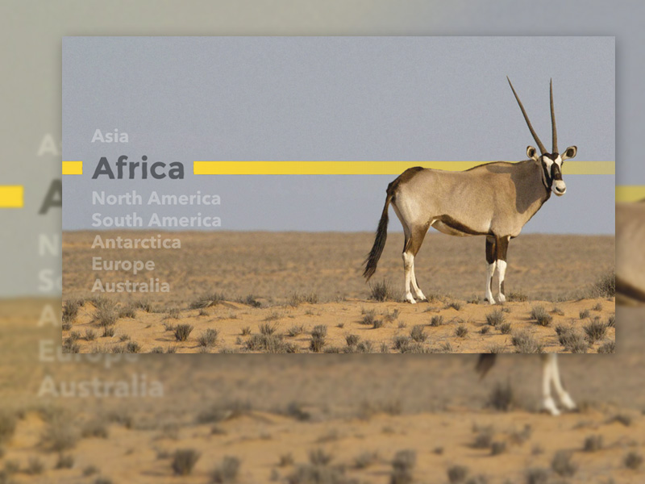

## [轉載] Animated Heat Distortion Effects with WebGL [Back](./../post.md)

> - Author: [Lucas Bebber](https://github.com/lbebber)
- Origin: https://tympanus.net/codrops/2016/05/03/animated-heat-distortion-effects-webgl/
- Time: May, 3rd, 2016

 

> A tutorial on how to use fragment shaders in WebGL to create an animated heat haze distortion effect on images and text.

Today we want to show you how to create some realistic looking heat haze distortion effects using fragment shaders in WebGL. The idea is to add a subtle animated distortion to a static image and some text.

> **Attention**: The demos use some modern web technology that might not work in older browsers.

**Please note that the current ZIP file is the compiled build of this project; source files and GitHub link are coming soon! Stay tuned.**

### Overview

For this article, we’ll pick apart one of the demos to give you an overview of how it works.

This effect uses **WebGL**. We’ve already seen WebGL being used in [some](http://tympanus.net/codrops/2016/04/26/the-aviator-animating-basic-3d-scene-threejs/) [experiments](http://tympanus.net/codrops/2015/11/04/rain-water-effect-experiments/) posted here on Codrops. [Here you can see an introduction on how it works](http://tympanus.net/codrops/2015/11/04/rain-water-effect-experiments/#WebGL_20). For a more in-depth explanation, take a look at the WebGL Fundamentals page, look into Learning WebGL, or start right away with three.js or pixi.js.
