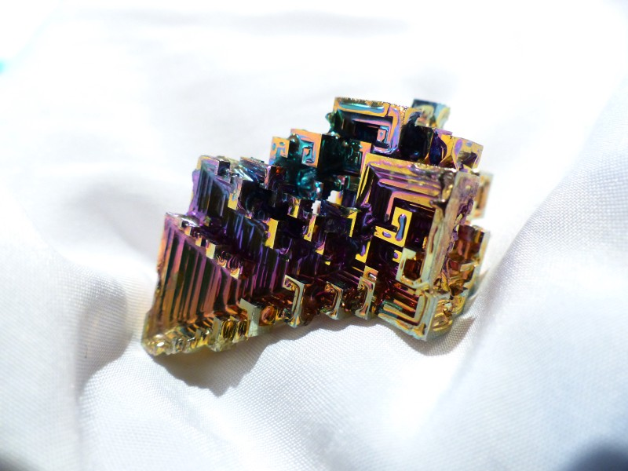

## [轉載] Presentational and Container Components [Back](./../post.md)

> - Author: [Dance Abramov](https://medium.com/@dan_abramov)
- Origin: https://medium.com/@dan_abramov/smart-and-dumb-components-7ca2f9a7c7d0#.qmkjybrk1
- Time: Mar, 23rd, 2015

[Bismuth](http://en.wikipedia.org/wiki/Bismuth)

There’s a simple pattern I find immensely useful when writing React applications. If [you’ve been doing React for a while](http://facebook.github.io/react/blog/2015/03/19/building-the-facebook-news-feed-with-relay.html), you have probably already discovered it. [This article explains it well](https://medium.com/@learnreact/container-components-c0e67432e005), but I want to add a few more points.

You’ll find your components much easier to reuse and reason about if you **divide them into two categories**. I call them Container and Presentational components* but I also heard Fat and Skinny, Smart and Dumb, Stateful and Pure, Screens and Components, etc. These all are not exactly the same, but the core idea is similar.

My **presentational** components:

- Are concerned with how things look.
- May contain both presentational and container components** inside, and usually have some DOM markup and styles of their own.
- Often allow containment via this.props.children.
- Have no dependencies on the rest of the app, such as Flux actions or stores.
- Don’t specify how the data is loaded or mutated.
- Receive data and callbacks exclusively via props.
- Rarely have their own state (when they do, it’s UI state rather than data).
- Are written as functional components unless they need state, lifecycle hooks, or performance optimizations.
- Examples: Page, Sidebar, Story, UserInfo, List.

