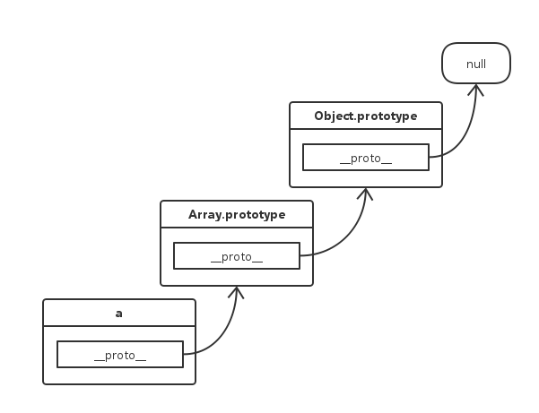

## [轉載] JavaScript 原型中的哲学思想 [Back](./../post.md)

> - Author: [JerryC](huang-jerryc.com)
- Origin: http://huang-jerryc.com/2016/06/28/JavaScript%E5%8E%9F%E5%9E%8B%E4%B8%AD%E7%9A%84%E5%93%B2%E5%AD%A6%E6%80%9D%E6%83%B3/
- Time: Jun, 28th, 2016


记得当年初试前端的时候，学习JavaScript过程中，原型问题一直让我疑惑许久，那时候捧着那本著名的红皮书，看到有关原型的讲解时，总是心存疑虑。


当在JavaScript世界中走过不少旅程之后，再次萌发起研究这部分知识的欲望，翻阅了不少书籍和资料，才搞懂`__proto__`和`prototype`的概念。

故以作此笔记，日后忘了可以回来看看。

如果你看的过程中觉得理解有些困难，把例子在代码中跑一跑，亲手试一试也许能解决不少疑惑。

### 一切皆为对象

> 殊不知，JavaScript的世界中的对象，追根溯源来自于一个 null

「一切皆为对象」，这句着实是一手好营销，易记，易上口，印象深刻。
万物初生时，一个`null`对象，凭空而生，接着`Object`、`Function`学着`null`的模样塑造了自己，并且它们彼此之间喜结连理，提供了`prototype`和`constructor`，一个给子孙提供了基因，一个则制造万千子子孙孙。
在JavaScript中，`null`也是作为一个对象存在，基于它继承的子子孙孙，当属对象。
乍一看，`null`像是上帝,而`Object`和`Function`犹如JavaScript世界中的**亚当**与**夏娃**。

### 原型指针 `__proto__`

在JavaScript中，每个对象都拥有一个原型对象，而指向该原型对象的内部指针则是`__proto__`，通过它可以从中继承原型对象的属性，原型是JavaScript中的基因链接，有了这个，才能知道这个对象的祖祖辈辈。从对象中的`__proto__`可以访问到他所继承的原型对象。

```js
var a = new Array();
a.__proto__ === Array.prototype;    // true
```

上面代码中，创建了一个Array的实例`a`，该实例的原型指向了`Array.prototype`。
`Array.prototype`本身也是一个对象，也有继承的原型:

```js
a.__proto__.__proto__ === Object.prototype  // true
// 等同于 Array.prototype.__proto__ === Object.prototype
```

这就说了明了，Array本身也是继承自Object的，那么Object的原型指向的是谁呢？


```js
a.__proto__.__proto__.__proto__ === null  // true
// 等同于 Object.prototype.__proto__ === null
```



所以说，JavaScript中的对象，追根溯源都是来自一个null对象。佛曰：万物皆空，善哉善哉。

除了使用.`__proto__`方式访问对象的原型，还可以通过`Object.getPrototypeOf`方法来获取对象的原型，以及通过`Object.setPrototypeOf`方法来重写对象的原型。

值得注意的是，按照语言标准，`__proto__`属性只有浏览器才需要部署，其他环境可以没有这个属性，而且前后的两根下划线，表示它本质是一个内部属性，不应该对使用者暴露。因此，应该尽量少用这个属性，而是用`Object.getPrototypeof`和`Object.setPrototypeOf`，进行原型对象的读写操作。
这里用`__proto__`属性来描述对象中的原型，是因为这样来得更加形象，且容易理解。

### 原型对象 `prototype`

函数作为JavaScript中的一等公民，它既是函数又是对象，函数的原型指向的是`Function.prototype`

```js
var Foo = function() {}
Foo.__proto__ === Function.prototype // true
```

函数实例除了拥有`__proto__`属性之外，还拥有`prototype`属性。
通过该函数构造的新的实例对象，其原型指针`__proto__`会指向该函数的`prototype`属性。