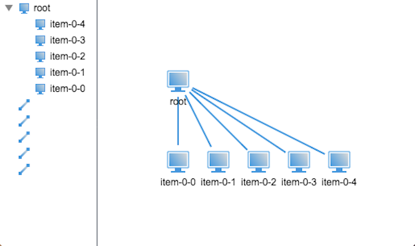

## [轉載] HTML5的WebGL實現的3D和2D拓撲樹 [Back](./../post.md)

> - Author: Eric
- Origin: http://www.hightopo.com/blog/453.html
- Time: Feb, 24th, 2016

在[HT for Web](http://www.hightopo.com/)中2D和3D应用都支持树状结构数据的展示，展现效果各异，2D上的树状结构在展现层级关系明显，但是如果数据量大的话，看起来就没那么直观，找到指定的节点比较困难，而3D上的树状结构在展现上配合[HT for Web](http://www.hightopo.com/)的弹力布局组件会显得比较直观，一眼望去可以把整个树状结构数据看个大概，但是在弹力布局的作用下，其层次结构看得就不是那么清晰了。所以这时候结构清晰的[3D树](http://www.hightopo.com/)的需求就来了，那么这个3D树具体长成啥样呢，我们来一起目睹下~


要实现这样的效果，该从何下手呢？接下来我们就将这个问题拆解成若干个小问题来解决。

### 1. 创建一个树状结构

有了解过[HT for Web](http://www.hightopo.com/)的朋友，对树状结构数据的创建应该都不陌生，在这里我就不做深入的探讨了。树状结构数据的创建很简单，在这里为了让代码更简洁，我封装了三个方法来创建树状结构数据，具体代码如下：

```js
/**
 * 创建连线
 * @param {ht.DataModel} dataModel - 数据容器
 * @param {ht.Node} source - 起点
 * @param {ht.Node} target - 终点
 */
function createEdge(dataModel, source, target) {
    // 创建连线，链接父亲节点及孩子节点
    var edge = new ht.Edge();
    edge.setSource(source);
    edge.setTarget(target);
    dataModel.add(edge);
}

/**
 * 创建节点对象
 * @param {ht.DataModel} dataModel - 数据容器
 * @param {ht.Node} [parent] - 父亲节点
 * @returns {ht.Node} 节点对象
 */
function createNode(dataModel, parent) {
    var node = new ht.Node();
    if (parent) {
        // 设置父亲节点
        node.setParent(parent);

        createEdge(dataModel, parent, node);
    }
    // 添加到数据容器中
    dataModel.add(node);
    return node;
}

/**
 * 创建结构树
 * @param {ht.DataModel} dataModel - 数据容器
 * @param {ht.Node} parent - 父亲节点
 * @param {Number} level - 深度
 * @param {Array} count - 每层节点个数
 * @param {function(ht.Node, Number, Number)} callback - 回调函数(节点对象，节点对应的层级，节点在层级中的编号)
 */
function createTreeNodes(dataModel, parent, level, count, callback) {
    level--;
    var num = (typeof count === 'number' ? count : count[level]);

    while (num--) {
        var node = createNode(dataModel, parent);
        // 调用回调函数，用户可以在回调里面设置节点相关属性
        callback(node, level, num);
        if (level === 0) continue;
        // 递归调用创建孩子节点
        createTreeNodes(dataModel, node, level, count, callback);
    }
}
```

嘿嘿，代码写得可能有些复杂了，简单的做法就是嵌套几个for循环来创建树状结构数据，在这里我就不多说了，接下来我们来探究第二个问题。

### 2. 在[2D拓扑](http://www.hightopo.com/)下模拟[3D树](http://www.hightopo.com/)状结构每层的半径计算

在3D下的树状结构体最大的问题就在于，每个节点的层次及每层节点围绕其父亲节点的半径计算。现在树状结构数据已经有了，那么接下来就该开始计算半径了，我们从两层树状结构开始推算：



我现在先创建了两层的树状结构，所有的子节点是一字排开，并没有环绕其父亲节点，那么我们该如何去确定这些孩子节点的位置呢？

首先我们得知道，每个末端节点都有一圈属于自己的领域，不然节点与节点之间将会存在重叠的情况，所以在这里，我们假定末端节点的领域半径为25，那么两个相邻节点之间的最短距离将是两倍的节点领域半径，也就是50，而这些末端节点将均匀地围绕在其父亲节点四周，那么相邻两个节点的张角就可以确认出来，有了张角，有了两点间的距离，那么节点绕其父亲节点的最短半径也就能计算出来了，假设张角为a，两点间最小距离为b，那么最小半径r的计算公式为：

r = b / 2 / sin(a / 2);

那么接下来我么就来布局下这个树，代码是这样写的：

```js
/**
 * 布局树
 * @param {ht.Node} root - 根节点
 * @param {Number} [minR] - 末端节点的最小半径
 */
function layout(root, minR) {
    // 设置默认半径
    minR = (minR == null ? 25 : minR);
    // 获取到所有的孩子节点对象数组
    var children = root.getChildren().toArray();
    // 获取孩子节点个数
    var len = children.length;
    // 计算张角
    var degree = Math.PI * 2 / len;
    // 根据三角函数计算绕父亲节点的半径
    var sin = Math.sin(degree / 2),
        r = minR / sin;
    // 获取父亲节点的位置坐标
    var rootPosition = root.p();

    children.forEach(function(child, index) {
        // 根据三角函数计算每个节点相对于父亲节点的偏移量
        var s = Math.sin(degree * index),
            c = Math.cos(degree * index),
            x = s * r,
            y = c * r;

        // 设置孩子节点的位置坐标
        child.p(x + rootPosition.x, y + rootPosition.y);
    });
}
```
