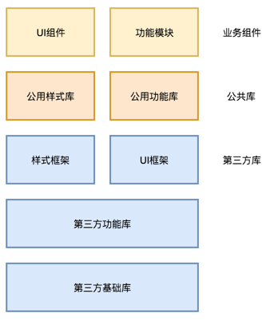
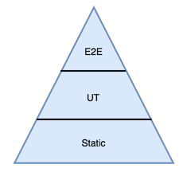

## [轉載] 前端技術體系大局觀 [Back](./../post.md)

> - Author: [张鑫](https://www.zhihu.com/people/zhangxin840)
- Origin: https://zhuanlan.zhihu.com/p/23185351
- Time: Oct, 25th, 2016

### 前后端分离

前后端分离的含义不只是前后端代码的分离，而是系统级的分离。

前端要有一整套独立的开发、线上服务与周边保障体系，从而更敏捷地支撑用户端业务的快速发展，并且实现跨业务线的技术资源横向复用。

前后端分离不是说前端工程师只需要关注浏览器或者App内的部分，由于系统级分离的需要，反而要更有全局意识，关注各种支撑系统的建设与发展。

### 前端技术体系

整个前端技术体系可以分为四个层次。线下层的重点在于提高开发效率，基础设施层重点关注稳定性，保障层重点关注质量与可用性，业务层重点关注服务的全面性和可复用性。

### 业务系统

业务系统是核心系统，也就是浏览器或者App中的前端应用本身，其它系统是对它的支持或者控制。业务系统可以分为业务组件、公共库和第三方库三个层次。

公共样式库有利于各业务线之间保持用户体验的一致性。各业务线在公共样式库的基础之上做可复用的UI组件，促进效率提升。

公共功能库包括常用的功能模块，比如登陆、支付、数据统计等等，可以用自动化测试的覆盖度来保障质量。

第三方库的组织构成：

- 样式框架：Bootstrap Material design
- UI框架：React VUE
- 第三方功能库：Fetch Modernizr Sentry GA 
- 第三方基础库：jQuery Zetpo Underscore Lodash

### 业务系统辅助

- 配置系统 - 集中管理各种配置项，比如功能开关，链接地址，AB测试控制等等。使用配置系统的好处是不用改代码并发布即可实现实时控制。集中配置项也更便于展示他们之间的关系。
- 消息系统 - 通知发布 信息推送 客服等即时通讯场景
- 鉴权系统 - 集中处理登陆、支付等需要风险控制较高的公共业务

### 监控系统

前端的监控系统要解决的问题是如何从用户的角度判断系统的可用性。只有用户端的可用才是真正的可用。

如果监控没有覆盖到终端，那么很可能会造成严重的幸存偏误。比如某个接口从后端的角度来看成功率接近百分之百，但事实上多数用户的请求都失败了，因为请求没有正确发到后端。

监控系统的功能分类：

- 可用性监控 - 页面访问成功率 接口成功率
- 错误监控 - 收集并汇总应用系统抛出的错误信息
- 业务指标监控 - 实时订单量 事件触发量

### 统计系统

统计系统和监控系统的区别在于，监控关注的是实时数据，统计关注的是全量数据，监控是为了提高团队的故障响应能力，统计是为产品与业务分析提供基础。

统计系统的功能分类：

- 性能统计
- 访问量统计
- 用户行为统计

### 测试系统

自动化测试是是一个塔型体系。静态检查是必须的，作为团队规范存在，覆盖全部代码。UT是局部覆盖的，关注基础功能。E2E是可选的，关注主流程和回归测试。

