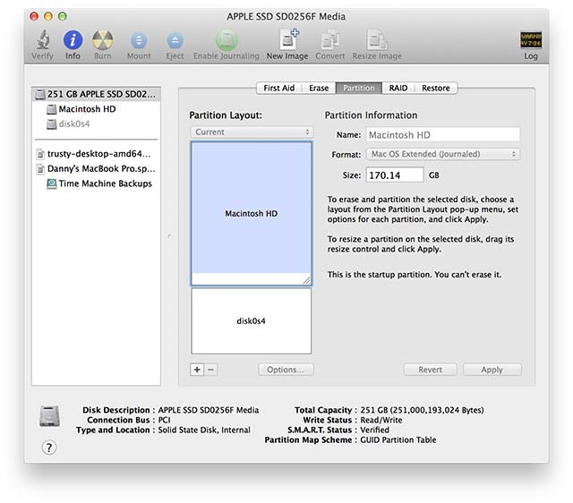
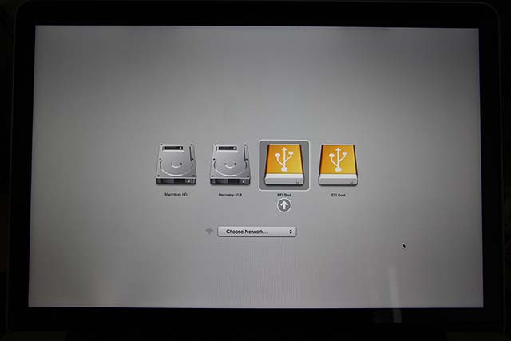

## How to install double-boot Ubuntu in a Macbook Air [Back](./qa.md)

### Download Ubuntu image

The installation need a copy of the Ubuntu desktop ISO image. **Be sure to choose a 64-bit version**, which can boot up in both BIOS and EFI modes.

### Write to a empty USB Driver

Find out a USB which has at least 2GB size to store the image, and be sure to format it with a apple format. 

After that, convert a ISO image into the apple specific one `.dmg` by using the following command:

```bash
hdiutil convert ./ubuntu.iso -format UDRW -o ./ubuntu.dmg
```

Then, mount your USB and check the serial number:

```bash
diskutil list

# may be /dev/diskN, in which N should be 0, 1 or any integer
```

And, unmount the USB before recording:

```bash
diskutil unmountDisk /dev/diskN
```

Recording:

```bash
sudo dd if=./ubuntu.img of=/dev/diskN bs=1m
```

If successfully, you can just eject your USB device:

```bash
diskutil eject /dev/diskN
```

### Clear out sizes and create a empty partition for installation



After creating the partition, you can just reboot and hold keying the `optional` key. After a while, some options have been shown to choose. Just remember to choose the EFI one.




